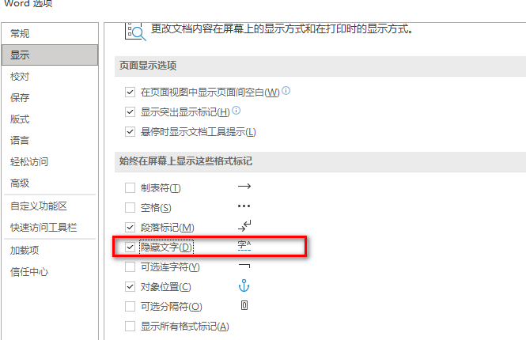
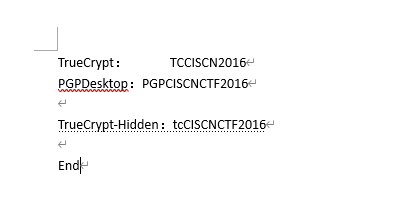
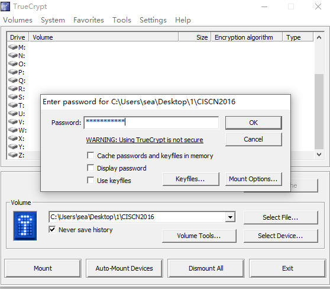
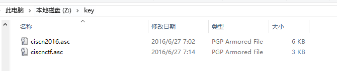
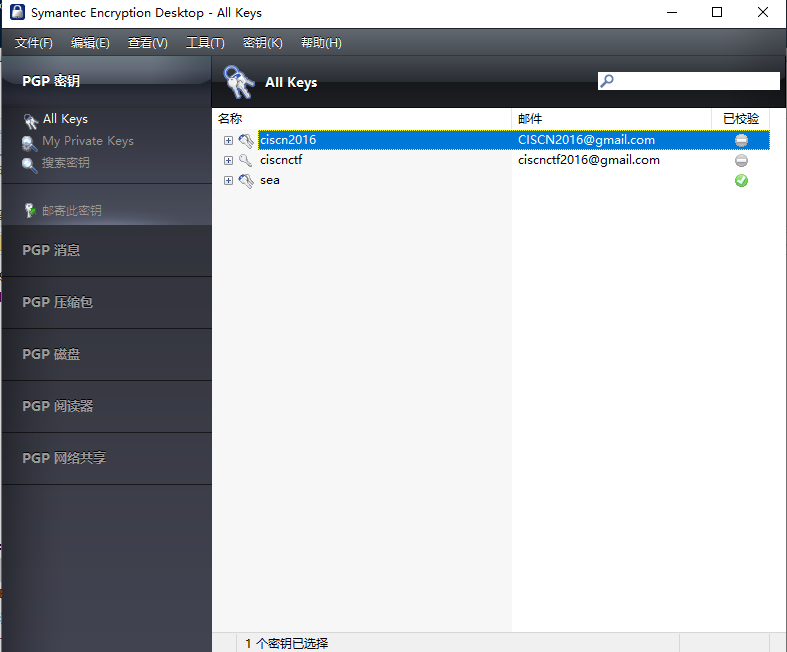
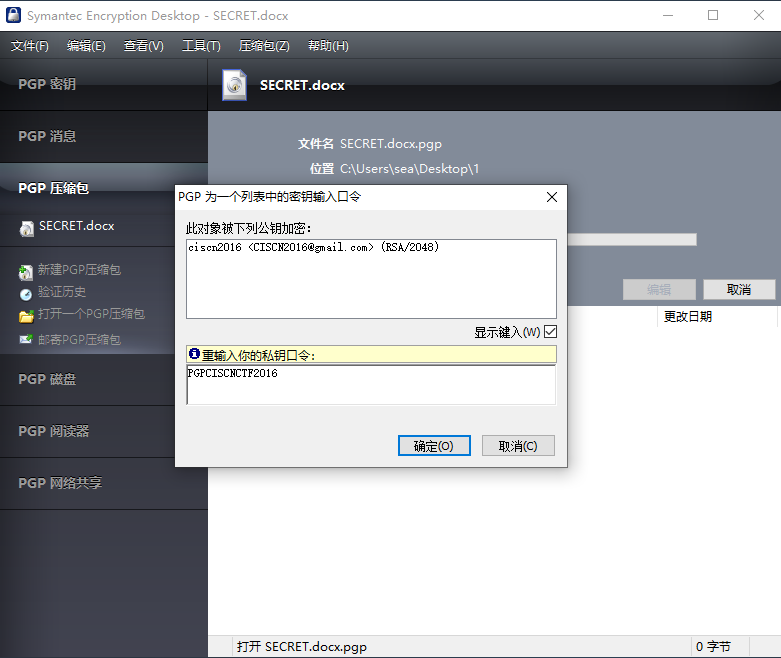
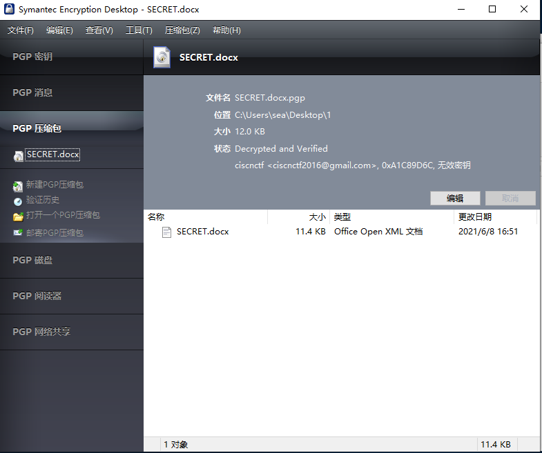

# Pretty Good Privacy

## 题目描述
---
```
随着岁月流逝，眼神和记忆力越来越差，就连自己曾经收到的加密文件也不知道该如何解密了。
Pretty Good Privacy，隐私性实在太好，好到连我自己都无法解开，说起来都是泪！
好在电脑中还存在一些片段，相关的文件都在“Pretty Good Privacy.RAR”这个压缩包里了，你能帮我揭开她的神秘面纱吗？

附件描述：

文件名：Pretty Good Privacy.rar

校验（SHA1）：61F783FED57FD6349059366A9A3074D28C155AE8
```

## 题目来源
---
2016全国大学生信息安全竞赛

## 主要知识点
---
TrueCrypt && PGP

## 题目分值
---
300

## 部署方式
---


## 解题思路
---

处理文件`眼神和记忆力越来越差.docx`，将所有字体调整为黑色并打开隐藏内容显示。



得到关键信息




word设置中显示隐藏内容、全选后设置字体颜色为黑色，发现隐藏信息：

```
TrueCrypt：  TCCISCN2016
PGPDesktop：PGPCISCNCTF2016
TrueCrypt-Hidden：tcCISCNCTF2016
```

Truecrypt分别用不同密码挂载加密文件，得到PGP的密钥对





第三步：

PGPDesktop导入密钥



解析密`SECRET.docx.pgp`





得到 flag{OH_NO_YOU_HAVE_FOUND_MY_ANOTHER_SECRET}

## 参考
---
