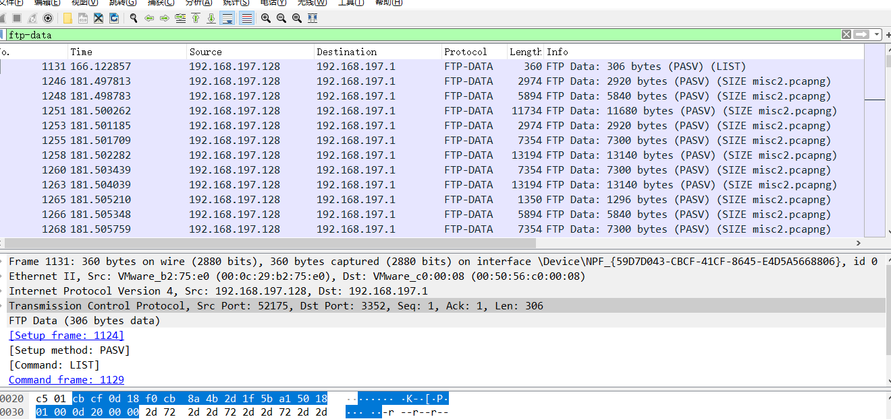
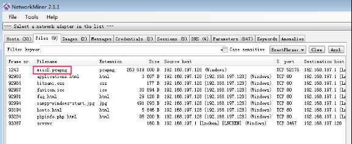
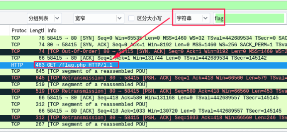
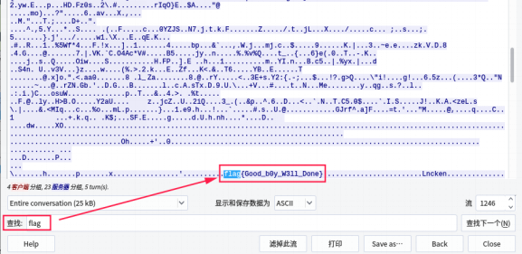

# embarrass

## 题目描述
---
```

```

## 题目来源
---
2017年全国大学生信息安全竞赛

## 主要知识点
---


## 题目分值
---
300

## 部署方式
---


## 解题思路
---

查看ftp-data，发现传输了一个流量包



将流量包dump出来，发现wireshark导出这个包过大，导出报错，可以使用`NetworkMiner`进行文件导出，我这里还是导出失败。

在互联网上找到别人导出的文件



分析分离出的misc2.pcapng文件，使用ctrl+F搜索flag：



选择追踪TCP流，再次搜索flag即可搜到：



flag{Good_b0y_W3ll_Done}

## 参考
---
https://bbs.ichunqiu.com/thread-25351-1-1.html