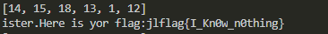

# 图片探秘

## 题目描述
---
```
在黑客的眼里，世界是可以用0和1来表是的，请用黑客的世界观来解决这题吧！

文件：点击下载附件

flag格式：flag{}
```

## 题目来源
---
JCTF 2014

## 主要知识点
---
维吉尼亚密码 

## 题目分值
---
300

## 部署方式
---


## 解题思路
---

查看附件原文后，可以明显看到是维吉尼亚密码，需要进行解密。

先找可能出现flag的地方，即带{}的地方，有两处，`kkqw{ erhvstpt} `和`Tsgw vt kcg xybs:xaxybs{W_Zf0j_o0fvxft}`

根据维吉尼亚密码密码的特性，在第二处出现了两次`xybs`，中间隔有两个字符，而它的明文极有可能是`flag`，所以基本上能断定秘钥长度为6位(4+2)。

首先利用`xybs`和`flag`计算出有四个key值为 `[18, 13, 1, 12]`，算法如下

```python
# 用一直明文先计算一波秘钥
def calc_yizhi_mingwen(miwen, mingwen):
    keys = []
    for i in range(len(miwen)):
        keys.append((ord(miwen[i]) - ord(mingwen[i]))%26)
    return keys

print calc_yizhi_mingwen("xybs", "flag")
```

然后利用`whlrs.Tsgw vt kcg xybs:xaxybs{W_Zf0j_o0fvxft}`计算爆破所有可能性，查看



算法如下

```python
def decrpyt(miwen, keys):
    print keys
    mingwen = []
    keys_index = 0
    keys_len = len(keys)
    for miwen_char in miwen:
        # a = 97 z = 122   A = 65 Z = 90
        miwen_char_ord = ord(miwen_char)
        if miwen_char_ord >= 97 and miwen_char_ord <= 122:
            mingwen_char = (miwen_char_ord%97 - keys[keys_index % keys_len]) % 26 + 97
            keys_index += 1
            mingwen.append(chr(mingwen_char))
        elif miwen_char_ord >= 65 and miwen_char_ord <= 90:
            mingwen_char = (miwen_char_ord%65 - keys[keys_index % keys_len]) % 26 + 65
            keys_index += 1
            mingwen.append(chr(mingwen_char))
        else:
            mingwen.append(miwen_char)
    return "".join(mingwen)

def burp_key(miwen):
    for x1 in range(26):
        for x2 in range(26):
            keys = [x1, x2, 18, 13, 1, 12]
            try:
                print decrpyt(miwen, keys)
            except Exception as e:
                print e
                pass

miwen = "whlrs.Tsgw vt kcg xybs:xaxybs{W_Zf0j_o0fvxft}"
burp_key(miwen)
```

得到结果  Here is yor flag:jlflag{I_Kn0w_n0thing}

## 参考
---
