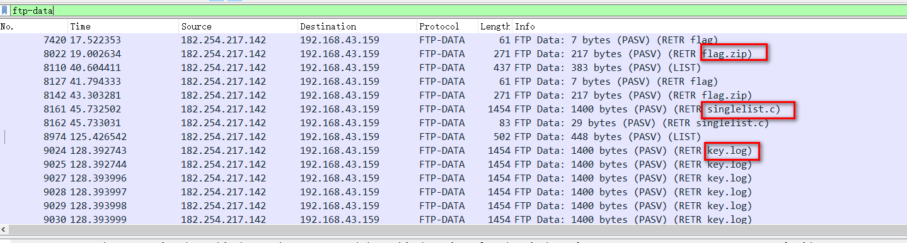
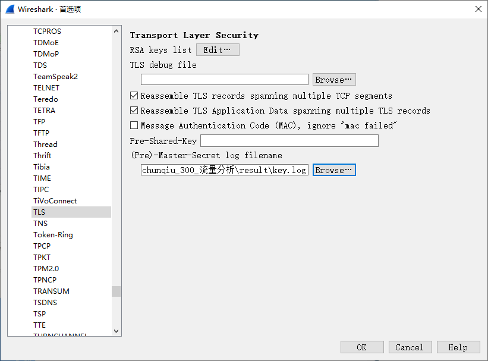
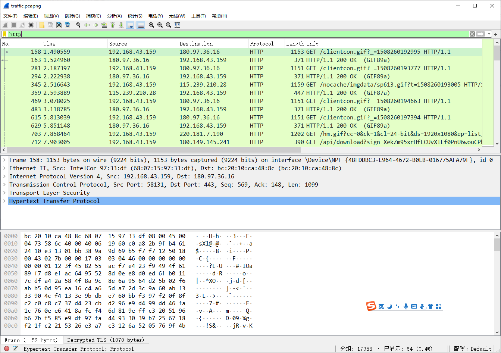
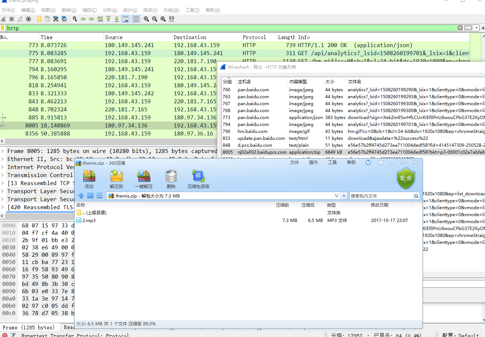
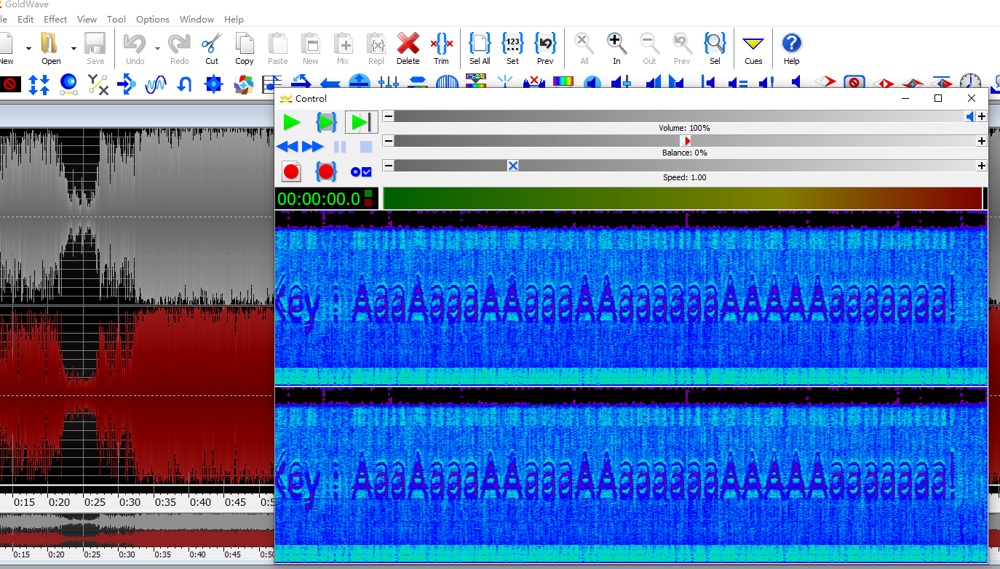

# 流量分析

## 题目描述
---
```
附件
```

## 题目来源
---
第三届上海市大学生网络安全大赛

## 主要知识点
---


## 题目分值
---
300

## 部署方式
---


## 解题思路
---

查看所有的`ftp=data`数据，发现存在flag.zip、singlelist.c、key.log三个文件，其中flag.zip已加密，singlelist.c目前还不知道什么用，key.log用来进行流量解密



将key.log导入wireshark



可以流量后可以看到很多HTTP信息了



分离数据，在流量包中找到一个压缩包，里面是`2.mp3`文件



常规套路，将文件放入`Audacity`查看，发现mp3文件最后部分存在杂音，查看频谱图



得到  key：AaaAaaaAAaaaAAaaaaaaAAAAAaaaaaaa!

解压flag.zip得到flag{4sun0_y0zora_sh0ka1h@n__#>>_<<#}

## 参考
---
