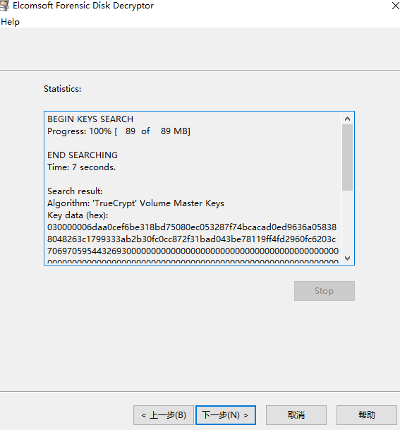

# 取证2

## 题目描述
---
```
还记得取证那题吗？既然有了取证神器，这里有一个可疑文件以及该存储该文件电脑的一个内存快照，那么接下来我们实战一下吧

文件：suspicion.7z
```

## 题目来源
---
ISC2016训练赛——phrackCTF

## 主要知识点
---


## 题目分值
---
350

## 部署方式
---


## 解题思路
---

解压文件，根据提示，使用volatility对内存映像进行审计

```
python vol.py imageinfo -f mem.vmem
```


查看进程

```
python vol.py psscan -f mem.vmem --profile=WinXPSP2x86
```


发现特殊进程TrueCrypt.exe，结合另一个加密文件suspicion，猜测为加密磁盘。

导出进程2012的内存，查找TrueCrypt的key

```
python vol.py -f mem.vmem --profile=WinXPSP2x86 memdump -p 2012 -D /tmp/
```

使用Elcomsoft Forensic Disk Decryptor导出TrueCrypt的key




使用Elcomsoft Forensic Disk Decryptor挂载suspicion


使用UltralISO加载文件


得到flag PCTF{T2reCrypt_15_N07_S3cu2e}


## 参考
---
