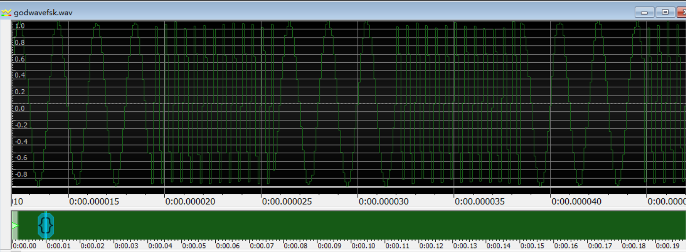

# 上帝之音 FSK

## 题目描述
---
```
这是一段神奇的声音，上帝之音似乎和无字天书一样，让我们这些凡人无法理解，琢磨不透，你能以上帝的角度，理解这段WAV的含义么？
Hint1: 你们做音频题都不喜欢看时域图？
Hint2: 在数据传输过程中，我们往往会使用一种自带时钟的编码以减少误码率
文件：点击下载附件
```

## 题目来源
---
ISC2016训练赛——phrackCTF

## 主要知识点
---


## 题目分值
---
400

## 部署方式
---


## 解题思路
---

Audacity 打开就是一段稀奇古怪的音频信号，仔细观察，发现不同段落其幅值有明显差异，应该是调幅了，MATLAB 导入 wav 文件看数据，发现大概是以 64 个点为周期，那么取幅值高的为 1，幅值低的为 0。

调幅改成调频而已，分析一下各个段落的频率，判断过 0 或峰值都可以。




```
clc;
clear;
y = audioread('godwavefsk.wav');

count = 0;
num = [];
for i = 1:length(y)
    if i ~= length(y)
        if y(i,1)<0 && y(i+1)>=0
            count = count + 1;
        end
    end
    if mod(i,64) == 0
        num = [num,count];
        count = 0;
    end
end
data = [];
for i = 1:length(num)
    if num(1,i)>=10
        data = [data,1];
    else
        data = [data,0];
    end
end

fid = fopen('data.txt','w');
for i = 1:length(data)
    fprintf(fid,'%d',data(1,i));
end
fclose(fid);
```


解出的数据是曼彻斯特编码，解码后是一张图片。

```python
# coding=utf-8

with open('data.txt', 'r') as f:
    data = f.readline()
    print len(data)
    count = 0
    res = 0
    ans = ''
    key = ""

    while data != '':
        pac = data[:2]
        if pac != '':
            if pac[0] == '0' and pac[1] == '1':
                res = (res<<1)|0
                count += 1
            if pac[0] == '1' and pac[1] == '0':
                res = (res<<1)|1
                count += 1
            if count == 8:
                ans += chr(res)
                count = 0
                res = 0
        else:
            break
        data = data[2:]

with open('out.png', 'wb') as f2:
    f2.write(ans)
```

## 参考
---
