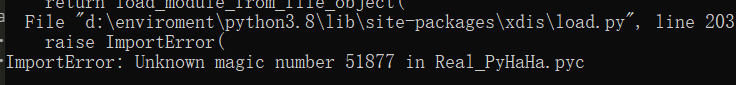

# pyHAHA

## 题目描述
---
```

```

## 题目来源
---
2017年全国大学生信息安全竞赛

## 主要知识点
---


## 题目分值
---


## 部署方式
---


## 解题思路
---

使用010editor查看pyc文件，发现文件被反向了


使用如下脚本将文件逆向

```
f = open('D:\\tmp\\Real_PyHaHa.pyc','wb')
with open('D:\\tmp\\PyHaHa.pyc','rb') as g:
	f.write(g.read()[::-1])
f.close()
```

在文件中发现存在一个压缩包


查看压缩包内容


给出了flag1、flag2和一个mp3文件`Dream It Possible.mp3`

```
flag1: ec8d57d820ad8c586e4be0122b442c871a3d71cd8036c45083d860caf1793ddc
flag2: c40a0be335babcfbd8c47aa771f6a2ceca2c8638caa5924da58286d2a942697e
```

MP3文件使用了`DeEgger Embedder`进行了信息隐藏，获取原始内容


可以看到是一堆Base32，不知道是做什么的，继续向下走

现在在对pyc文件进行反编译



提示magic number不正确，在`Real_PyHaHa.pyc`文件头补上正确的pyc文件头`03 F3 0D 0A`


反编译后得到


```python
# uncompyle6 version 3.7.4
# Python bytecode 2.7 (62211)
# Decompiled from: Python 3.8.2 (tags/v3.8.2:7b3ab59, Feb 25 2020, 23:03:10) [MSC v.1916 64 bit (AMD64)]
# Embedded file name: Fl4g.py
# Compiled at: 2017-07-02 00:15:33
from os import urandom

def generate(m, k):
    result = 0
    for i in bin(m ^ k)[2:]:
        result = result << 1
        if int(i):
            result = result ^ m ^ k
        if result >> 256:
            result = result ^ P

    return result


def encrypt(seed):
    key = int(urandom(32).encode('hex'), 16)
    while True:
        yield key
        key = generate(key, seed) + 233333333333


def convert(string):
    return int(string.encode('hex'), 16)


P = 115792089237316195423570985008687907853269984665640564039457584007913129640997
flag1 = 'ThIs_Fl4g_Is_Ri9ht'
flag2 = 'Hey_Fl4g_Is_Not_HeRe'
key = int(urandom(32).encode('hex'), 16)
data = open('data.txt', 'r').read()
result = encrypt(key)
encrypt1 = bin(int(data, 2) ^ eval('0x' + hex(result.next())[2:-1] * 22))[2:]
encrypt2 = hex(convert(flag1) ^ result.next())[2:-1]
encrypt3 = hex(convert(flag2) ^ result.next())[2:-1]
print 'flag1:', encrypt2
print 'flag2:', encrypt3
f = open('encrypt.txt', 'w')
f.write(encrypt1)
f.close()
# okay decompiling Real_PyHaHa.pyc
```

该脚本做了这样的操作，加密算法查了一下，是这样


需要找到`encrypt1`的内容才能进行真正的解密。

mp3分离出来的base32直接解码得到的东西不对，猜测隐写，尝试发现base32解码再编码后尾部不同，是有隐写了，使用下面的代码进行内容提取。

```python
import base64

def get_base32_diff_value(stego_line, normal_line):
    base32chars = 'ABCDEFGHIJKLMNOPQRSTUVWXYZ0123456789'
    for i in range(len(normal_line)):
        if stego_line[i] != normal_line[i]:
            return abs(base32chars.index(chr(stego_line[i]))-base32chars.index(chr(normal_line[i])))
    return 0

# base32 隐写解密
def base32stego_decode(lines):
    res = ''
    for i in lines:
        stego_line = i.strip()
        normal_line = base64.b32encode(base64.b32decode(i.strip()))
        diff = get_base32_diff_value(stego_line, normal_line)
        if '=' not in str(stego_line):
            continue
        if diff:
            res += bin(diff)[2:]
        else:
            res += '0'
    return res

with open("Dream It Possible - extracted.txt", 'rb') as f:
    file_lines = f.readlines()
en=open("encrypt.txt","w")
en.write(base32stego_decode(file_lines))
en.close()
```

得到结果


最后进行解密，其中`encrypt2`,`encrypt3`是在压缩包中提取的flag1和flag2值。

```python
from os import urandom

def generate(m, k):
    result = 0
    for i in bin(m ^ k)[2:]:
        result = result << 1
        if int(i):
            result = result ^ m ^ k
        if result >> 256:
            result = result ^ P
            continue
    return result

def convert(string):
    return int(string.encode('hex'), 16)


P = 0x10000000000000000000000000000000000000000000000000000000000000425L
flag1 = 'ThIs_Fl4g_Is_Ri9ht'
flag2 = 'Hey_Fl4g_Is_Not_HeRe'
encrypt1 = open('encrypt.txt', 'r').read()
encrypt2 = 0xec8d57d820ad8c586e4be0122b442c871a3d71cd8036c45083d860caf1793ddc
encrypt3 = 0xc40a0be335babcfbd8c47aa771f6a2ceca2c8638caa5924da58286d2a942697e
key3 = encrypt3 ^ convert(flag2)
key2 = encrypt2 ^ convert(flag1)
print('Found key2:',key2)
print('Found key3:',key3)

tmp = key3 - 233333333333L
for i in range(0,255):
    tmp = generate(tmp,0)
seed = tmp ^ key2
print 'Found seed:',seed
print 'use seed generate key3:',generate(key2,seed)+233333333333L

tmp = key2 - 233333333333L
for i in range(0,255):
    tmp = generate(tmp,0)
key1 = tmp ^ seed
print 'Found key1:',key1
print 'use key1 generate key2:',generate(key1,seed)+233333333333L

result = eval(hex(int(encrypt1,2))[:-1]) ^ eval('0x'+hex(key1)[2:-1]*22)
data = open('data.txt', 'w')
data.write(bin(result)[2:])
data.close()
```


得到一堆二进制，是一张图片，写代码转码

```python
from PIL import Image

str=open("data.txt","r").read()
length=240
width=30
pic=Image.new("RGB",(length,width))
i=0
for x in range(length):
	for y in range(width):
		if str[i] == '0':
			pic.putpixel([x,y],(0,0,0))
		else:
			pic.putpixel([x,y],(255,255,255))
		i += 1
pic.show()
pic.save("flag.png")
```

得到最终的flag


flag{H4pPy_pY_C0dlng}

## 参考
---
