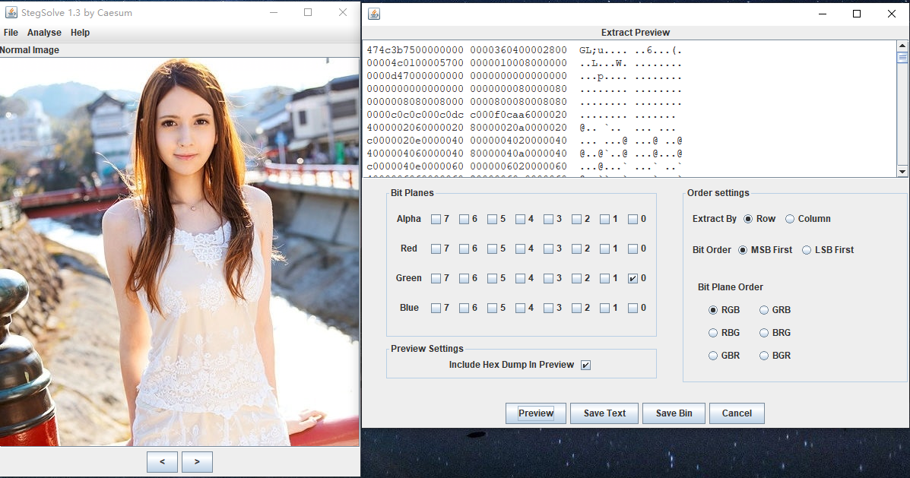
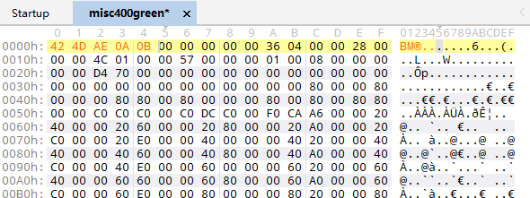
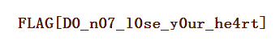

# 神秘的文件

## 题目描述
---
```
不知名的文件，貌似已经损坏，你能找到里面隐藏的信息吗？

文件：点击下载附件

flag格式：flag{}
```

## 题目来源
---
JCTF 2014

## 主要知识点
---


## 题目分值
---
500

## 部署方式
---


## 解题思路
---

使用`StegSolve`将附件给出的图片绿色通道最低为提取保存为一个文件



将得到文件的修改为bmp头，如下



获得flag



flag{D0_n07_10se_y0ur_he4rt}

## 参考
---
https://wooyun.js.org/drops/JCTF%20Writeup.html