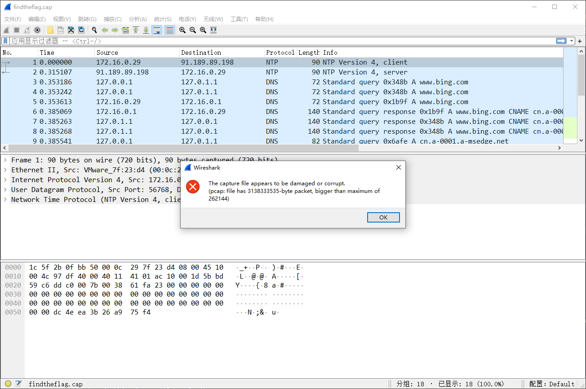
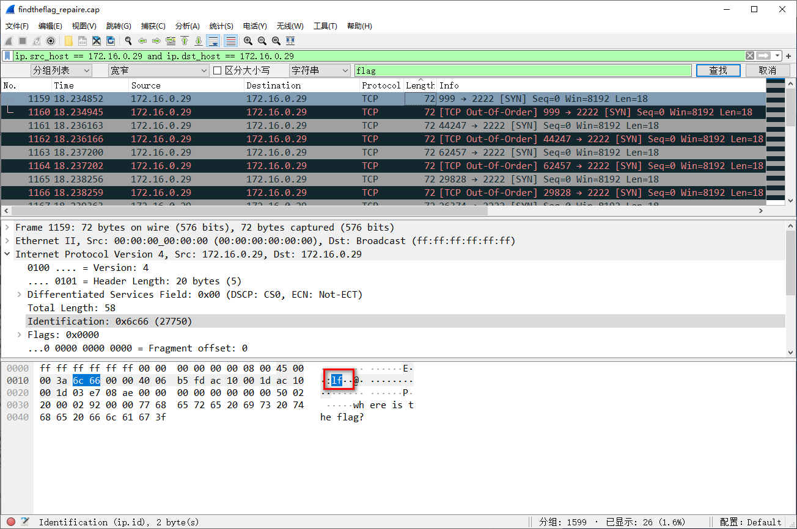
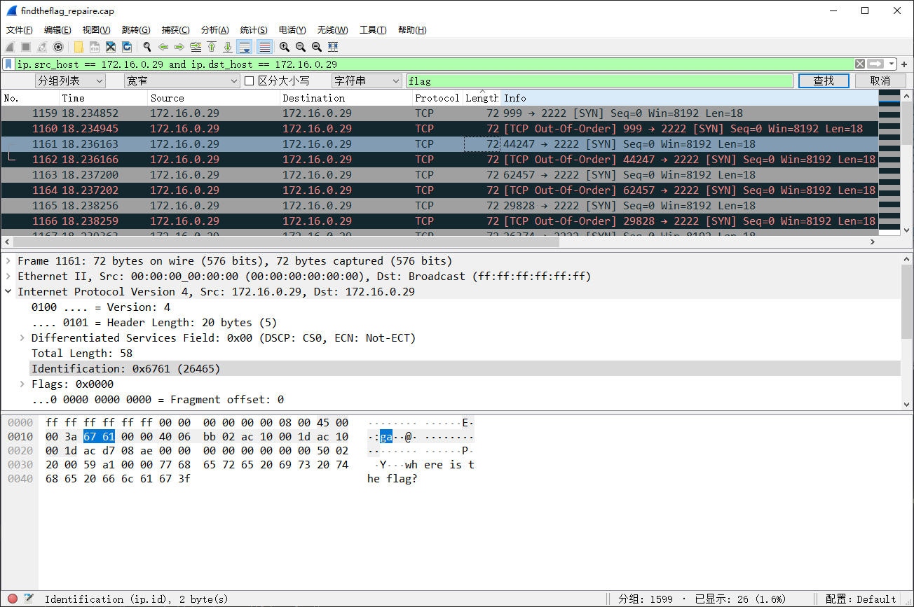

# find th flag

## 题目描述
---
```
find the flag
```

## 题目来源
---
第一届“百度杯”信息安全攻防总决赛 线上选拔赛

## 主要知识点
---
流量包修复 隐蔽传输

## 题目分值
---
50

## 部署方式
---


## 解题思路
---
打开流量文件报错，提示 `File has 3138333535-byte packet, bigger than maximum of 262144`




可以使用攻击[pcapfix](https://github.com/Rup0rt/pcapfix)进行流量修复

```
$ ./pcapfix 
pcapfix 1.1.5 (c) 2012-2021 Robert Krause

Usage: ./pcapfix [OPTIONS] filename
OPTIONS:	-d        , --deep-scan          	Deep scan (pcap only)
            -s        , --soft-mode          	Soft mode (packet detection)
            -n        , --pcapng             	force pcapng format
            -o <file> , --outfile <file>     	set output file name
            -k        , --keep-outfile       	don't delete the output file if nothing needed to be fixed
            -t <nr>   , --data-link-type <nr>	Data link type
            -v        , --verbose            	Verbose output
```

使用`ip.src_host == 172.16.0.29 and ip.dst_host == 172.16.0.29`如下查询条件并搜索字符串`flag`，可以看到如下的流量





可以明显看到，在不同包的同一位置内容反向拼接可以得到flag，实现了隐蔽传输，所以最终拼接flag为

flag{aha!_you_found_it!}

## 参考
---
