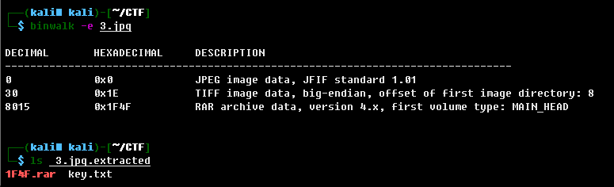
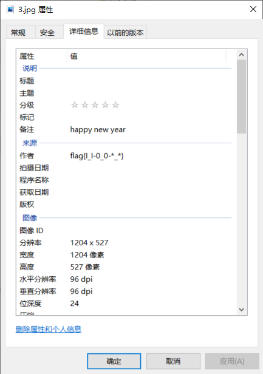

# 题目名称

## 题目描述
---
```
我不是一个简单的图片

我是一个有内涵的图片
```

## 题目来源
---
“百度杯”2017年春秋欢乐赛

## 主要知识点
---
图片附加信息

## 题目分值
---
50

## 部署方式
---


## 解题思路
---
binwalk跑了一圈发现什么都没有



查看文件信息时发现flag在`作者`位置



`flag{I_I-0_0-*_*}`

## 参考
---
