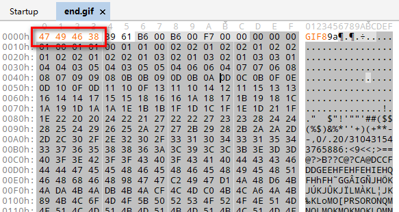
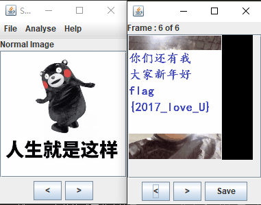

# 小电影

## 题目描述
---
```
我说过

这次比赛是让大家开开心心的度过的

所以

送给你们一个小电影
```

## 题目来源
---
“百度杯”2017年春秋欢乐赛

## 主要知识点
---
gif文件修复

## 题目分值
---
50

## 部署方式
---


## 解题思路
---

是一个Gif文件，但是提示格式错误打不开。使用notepad++打开文件，发现文件头开头是9a，然而Gif文件格式开头应该是GIF89a，修改后可以打开。打开后最后一帧图片就是flag。



使用`StegSolve`分帧查看



flag{2017_love_U}

## 参考
---
