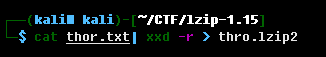
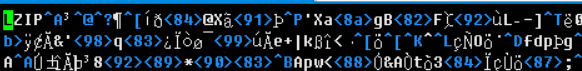
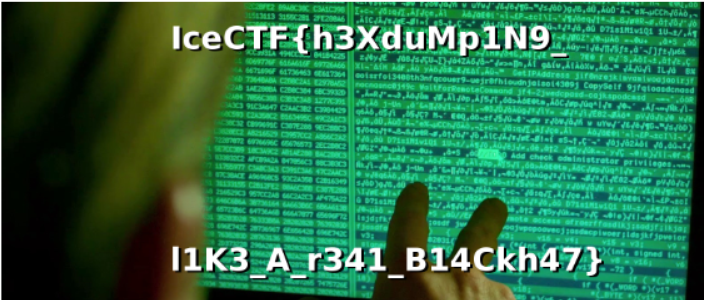

# Thor's a hacker now

## 题目描述
---
```
Thor has been staring at this for hours and he can't make any sense out of it, can you help him figure out what it is? thor.txt
```

## 题目来源
---
IceCTF

## 主要知识点
---


## 题目分值
---
60

## 部署方式
---


## 解题思路
---

使用xxd将题目给出的格式转化为原始bin文件

```
./lzip -d thor.lzip2
```



可以看到文件开头为`LZIP`



所以肯定是使用lizp来进行解压，lzip官方地址 https://www.nongnu.org/lzip/

```
./lzip -d thro.lzip2
```


得到的是一张图片，查看即可看到flag



IceCTF{h3XduMp1N9_l1K3_A_r341_B14Ckh47}


解压后
## 参考
---
