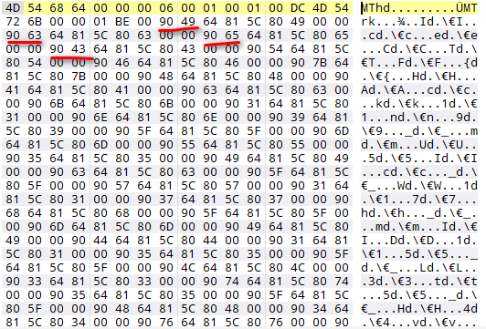

# Blue Monday

## 题目描述
---
```
Those who came before me lived through their vocations From the past until completion, they'll turn away no more And still I find it so hard to say what I need to say But I'm quite sure that you'll tell me just how I should feel today. blue_monday
```

## 题目来源
---
IceCTF

## 主要知识点
---


## 题目分值
---
80

## 部署方式
---


## 解题思路
---

使用二进制文件打开后发现这个文件中每个`90`和`64`之间的字符连起来就是flag



使用脚本泡一下

```python
f=open('blue_monday','r')
flag=''
s=f.read()
length=len(s)
i=0
while i<length:
    if ord(s[i])==0x64:
        flag+=s[i-1]
    i=i+1
```

得到`IceCTF{HAck1n9_mU5Ic_W17h_mID15_L3t5_H4vE_a_r4v3}`

## 参考
---
