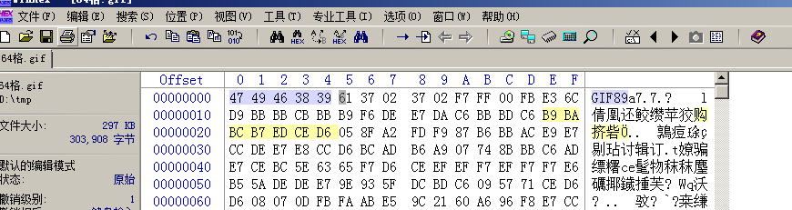
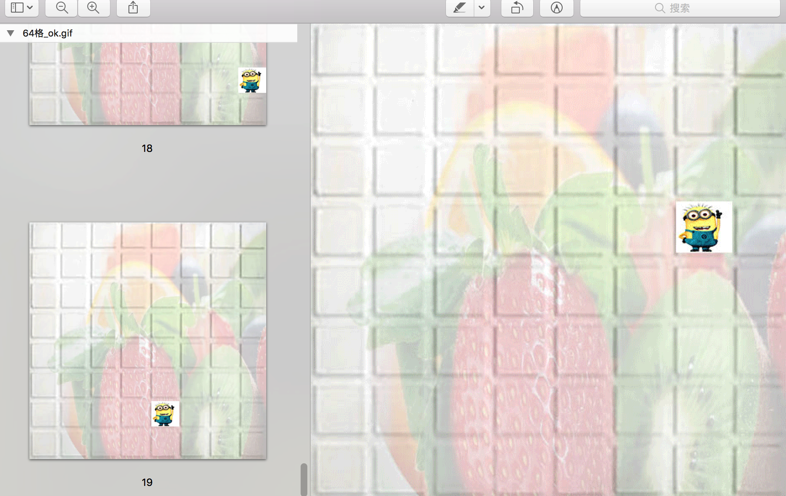
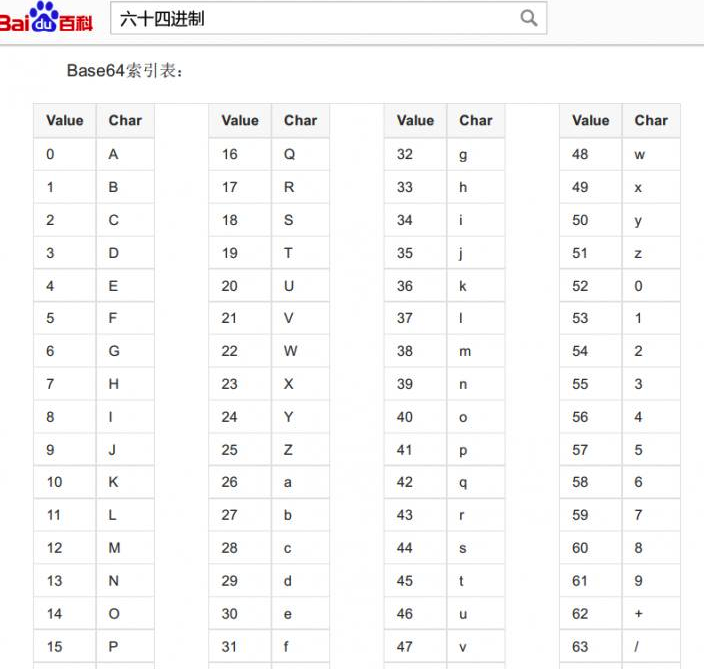

# 64格

## 题目描述
```
听说睁大眼睛就能找到flag O.O
格式：CTF{ }
```

## 解题思路

下载题目解压得到64格.gif，打开提示图像损坏，扔winhex，没有看见熟悉的"GIF89a"，补全头得到正常的gif。



打开gif，看到有19帧小黄人在动；



脑洞一下，从第一行第一列，从左到右，从上到下，一次标标注1-64。用Base64索引表对应一下。



得到密文`Q1RGe2FiY19kZWZfZ30`，由于base64算法，进行补全`Q1RGe2FiY19kZWZfZ30=`,base64解密`CTF{abc_def_g}`。
