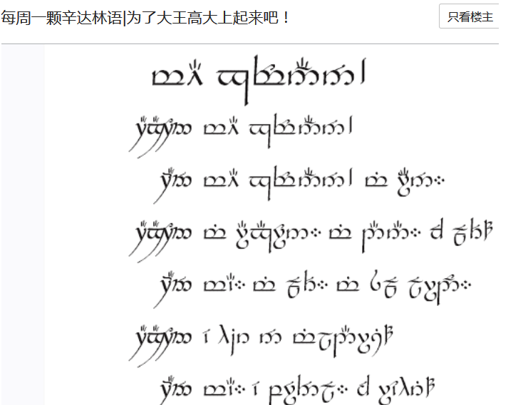
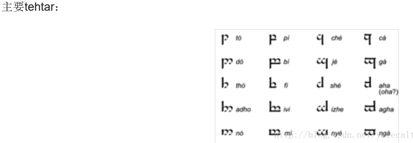
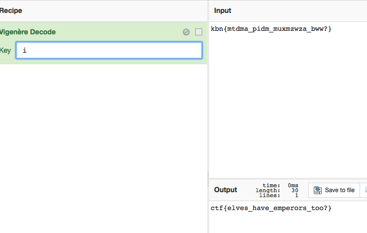

# Elvish-Caesar

## 题目描述
```
Hint:YOU SHALL NOT PASS. Also, remember the flag format! ;
格式：ctf{}
解题链接： elvish.png
```

## 解题思路
这道题脑洞给太大，直接用网上的教程吧。

题目叫Elvish-Caesar，前者是小精灵，后者是凯撒，凯撒么肯定就是凯撒加密了。

图片的长相有没有flag{xxx_xxx_xxx_xxx}或者ctf{xxx_xxx_xxx_xx}的感觉？ 

目测题目应该是用精灵语，解码后再凯撒 

百科介绍elvish语言有三种 ：
1. 沙拉堤文字（Sarati）：诺多精灵卢米尔（Rúmil）首先为精灵语发明的文字 
2. 腾格瓦文字（Tengwar）：诺多精灵费诺（Feanor）承卢米尔，为昆雅发明的文字 
3. 色斯文（Cirth）：中土大陆上辛达精灵戴隆（Daeron）为辛达林发明的文字，后为矮人族广泛使用





看图片就知道，我们用的是T语 

深入了解后，T也有好几种，T-que,T-sin等等，都尝试翻译下（只需前三个即可，按照规则，出来的字符凯撒后是ctf，只要翻译出的是ctf，dug，evh，fwi，gxj，hyk，izl，jam，kbn，lco，mdp，neq，ofr，pgs，qht，riu，sjv，tkw，ulx，vmy，wnz，xoa，ypb，zqc，ard，bse这些就行） 

尝试后，判断应该是T-swe，对照图表解码 

kbn{mtdma_pidm_muxmzwza_bww?} 

凯撒就可以了



ctf{elves_have_emperors_too?} 