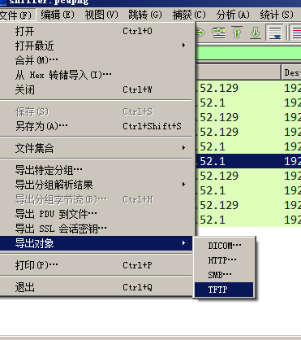
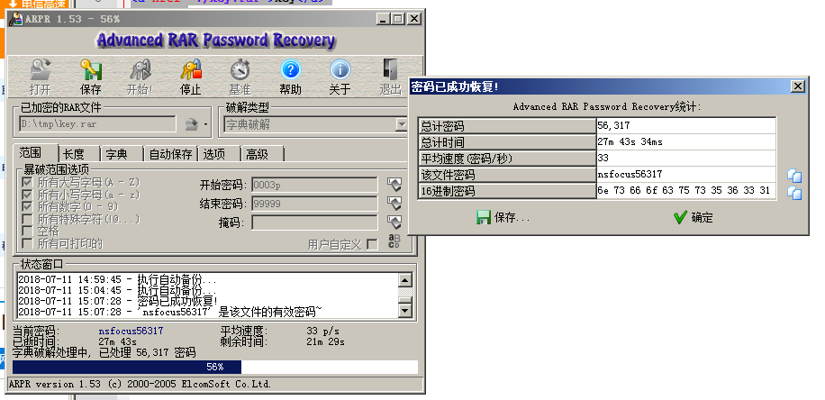

# NSCTF misc250

## 题目描述
```
小绿在学习了wireshark后，在局域网内抓到了室友下载的小东东0.0 你能帮他找到吗？
格式：flag{}
解题链接： sniffer.pcapng
```

## 解题思路
使用wireshark打开流量包，使用下属方式导出http请求文件。



导出后，有两个文件，一个`%5c`，一个`key.rar`，其中`%5c`中提示了密码为

```html
<html>
<head><tittle>KEY</tittle></head>
<body>
<p>密码是nsfocus+5位数字</p>
<a href="./key.rar">key</a>
</body>
</html>
```

所以造密码表

```python
#!/usr/bin/env python
#-*- coding: utf-8 -*-
"""
@Author : darkN0te
@Create date : 2018-07-11
@description : 生成密码表
@Update date :   
"""  

f = open("dict.txt","w")
for i in range(100000):
    f.write("nsfocus%05d\n"%i)
f.close()
```


找到密码`nsfocus56317`。



打开`key.rar`输入密码，得到flag。

flag{NCTF_R4r_Cr4ck}

