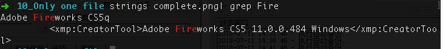
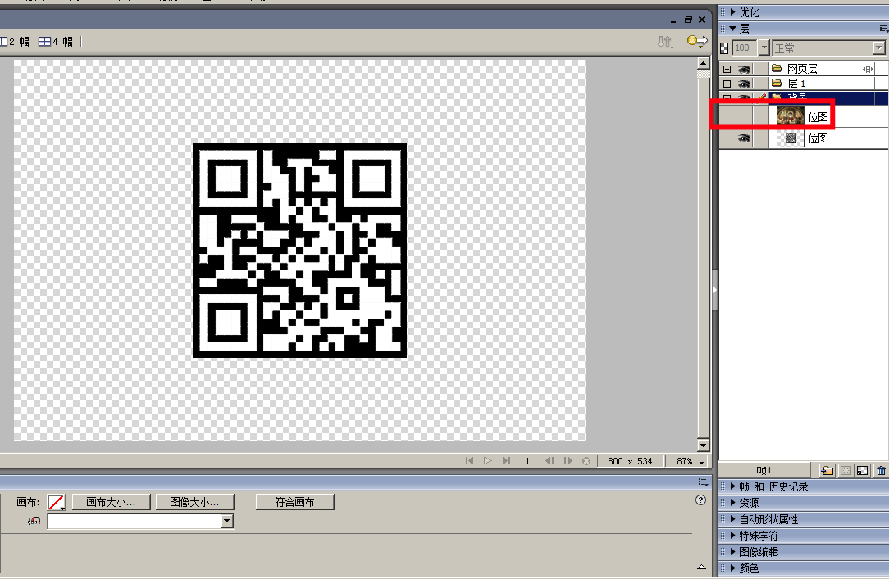
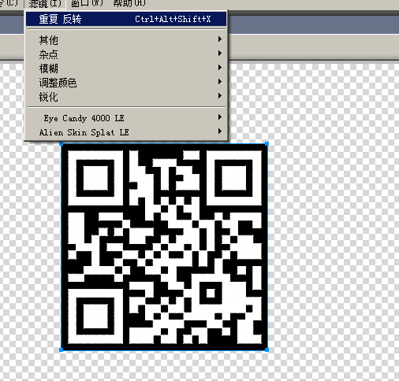

# Only one file

## 题目描述
```
懒的人都做得快。
hint：听说Linux很好用
格式：CTF{ }
解题链接： onlyOneFile
```

## 解题思路

解压文件`onlyOneFile.zip`后，发现只有`xaa`有PNG头，推测这些都是都是一张图片，把所有文件写入一个文件中尝试。

```bash
cat onlyOneFile/* > complete.png
```

确实打开文件了。找个各种隐写没内容，根据套路查看了一下`Fireworks`，果然有，尝试用`Fireworks`打开图片看一下。





关闭最上次图层，第二个图层是一个二维码，反色。



CTF{L1nUx_1s_G00d}
