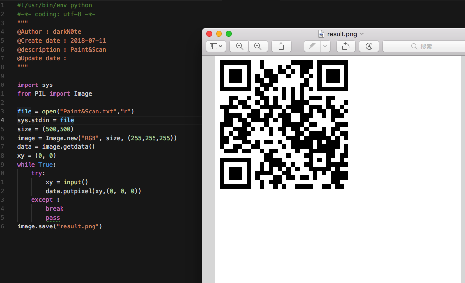

# Paint&Scan

## 题目描述
```
画一画，扫一扫，图出则flag见...
格式：CTF{ }
解题链接： Paint_Scan.zip
```

## 解题思路
根据题目给出的做表画图，然后就能得到一个二维码，扫描即flag。

```python
#!/usr/bin/env python
#-*- coding: utf-8 -*-
"""
@Author : darkN0te
@Create date : 2018-07-11
@description : Paint&Scan
@Update date :   
"""  

import sys
from PIL import Image

file = open("Paint&Scan.txt","r")
sys.stdin = file
size = (500,500)
image = Image.new("RGB", size, (255,255,255))
data = image.getdata()
xy = (0, 0)
while True:
    try:
        xy = input()
        data.putpixel(xy,(0, 0, 0))
    except :
        break
        pass
image.save("result.png")
```



CTF{simplectf_QR_code}