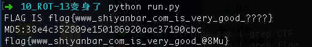

# ROT-13变身了

## 题目描述
```
提示：1、回旋13，回不回？ 2、有81,450,625种可能性
格式：flag{}
解题链接： rot-13.txt
```

## 解题思路

密文为
```
83 89 78 84 45 86 96 45 115 121 110 116 136 132 132 132 108 128 117 118 134 110 123 111 110 127 108 112 124 122 108 118 128 108 131 114 127 134 108 116 124 124 113 108 76 76 76 76 138 23 90 81 66 71 64 69 114 65 112 64 66 63 69 61 70 114 62 66 61 62 69 67 70 63 61 110 110 112 64 68 62 70 61 112 111 112
```

首先将密文转为ascii值，然后题目提示rot回旋13，这里用rot-13就行了。获得明文

```python
asciiArr = [83,89,78,84,45,86,96,45,115,121,110,116,136,132,132,132,108,128,117,118,134,110,123,111,110,127,108,112,124,122,108,118,128,108,131,114,127,134,108,116,124,124,113,108,76,76,76,76,138,23,90,81,66,71,64,69,114,65,112,64,66,63,69,61,70,114,62,66,61,62,69,67,70,63,61,110,110,112,64,68,62,70,61,112,111,112]
asciiArr = [chr(i-13)for i in asciiArr]
clearText = "".join(asciiArr)
print clearText

FLAG IS flag{www_shiyanbar_com_is_very_good_????}
MD5:38e4c352809e150186920aac37190cbc
```

只有4位未知，随便跑脚本就行了。

```python
#!/usr/bin/env python
#-*- coding: utf-8 -*-
"""
@Author : darkN0te
@Create date : 2018-07-11
@description : ROT13
@Update date :   
"""  

import hashlib
import string

'''
FLAG IS flag{www_shiyanbar_com_is_very_good_????}
MD5:38e4c352809e150186920aac37190cbc
'''

md5Str = "38e4c352809e150186920aac37190cbc"
needScan = string.printable


for i in needScan:
    for j in needScan:
        for k in needScan:
            for m in needScan:
                flag = "flag{www_shiyanbar_com_is_very_good_" + i + j + k + m + "}"
                md5 = hashlib.md5()
                md5.update(flag)
                if md5.hexdigest() == md5Str:
                    print flag
                    exit()
```



flag{www_shiyanbar_com_is_very_good_@8Mu}