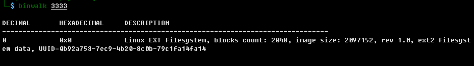
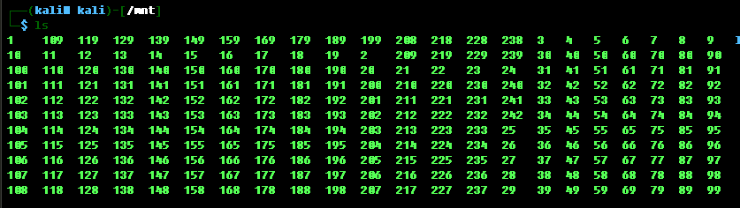
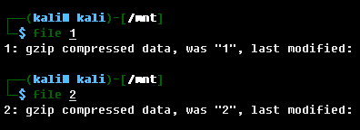
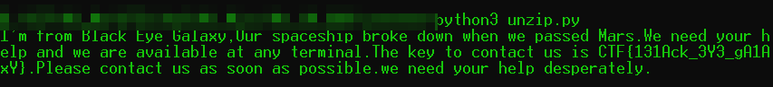

# SOS

## 题目描述
```
一份来自外太空的文件
格式：CTF{}
解题链接： sos
```

## 解题思路

3333是一个EXT文件系统



挂载并查看文件




这些文件都是gzip



使用python可以进行解码


写一段代码获取所有的原文

```python
#!/usr/bin/env python
# -*- coding: utf-8 -*-

import os
import gzip
 
out_name = 'out'
if not os.path.exists(out_name): #如果没有out文件夹，就创建一个
    os.mkdir(out_name)
 
out_dir = os.path.join(os.path.abspath(os.path.dirname(__file__)), out_name)

#解压gzip文件
def un_gzip(filename):
    f_gzip = gzip.open(filename, 'r') #打开gizp文件
    open(os.path.join(out_dir, filename), 'w').write(f_gzip.read().decode())  #压缩文件读出是byte，要decode()转成string
    f_gzip.close()

#将文件内容进行组合
def combine():
    out = ''
    for i in range(1,243):
        with open(os.path.join(out_dir, str(i))) as f:
            out += f.read()
    print(out)
 
if __name__ == '__main__':
    all_file = os.listdir()  #加载目录下所有的文件
    all_file.remove('unzip.py')  #本py文件不算在内
    for i in all_file:
        if os.path.isfile(i):   #判断是否为文件，因为我们创建了out文件夹
            un_gzip(i)
    combine()

```



 CTF{131Ack_3Y3_gA1AxY}

