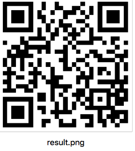

# WTF

## 题目描述
```
通过奇怪的字符串发现其中隐藏的信息
解题链接： code.txt
```

## 解题思路

看了密文发现有两个`=`，用base64解密一下，发现全是0和1，推测是二维码，写一段脚本画一下。

```python
#!/usr/bin/env python
#-*- coding: utf-8 -*-
"""
@Author : darkN0te
@Create date : 2018-07-11
@description : WTF
@Update date :   
"""  

import sys
from PIL import Image

file = open("code.txt","r")
content = file.read().decode("base64")
length = len(content)

size = (256,256)
image = Image.new("RGB", size, (255,255,255))
data = image.getdata()
xy = (0, 0)
for i in range(length):
    try:
        if content[i] == '1':
            xy = (i/256,i%256)
            data.putpixel(xy,(0, 0, 0))
    except :
        pass
image.save("result.png")
```



flag{QR_Code_666_!!_?}