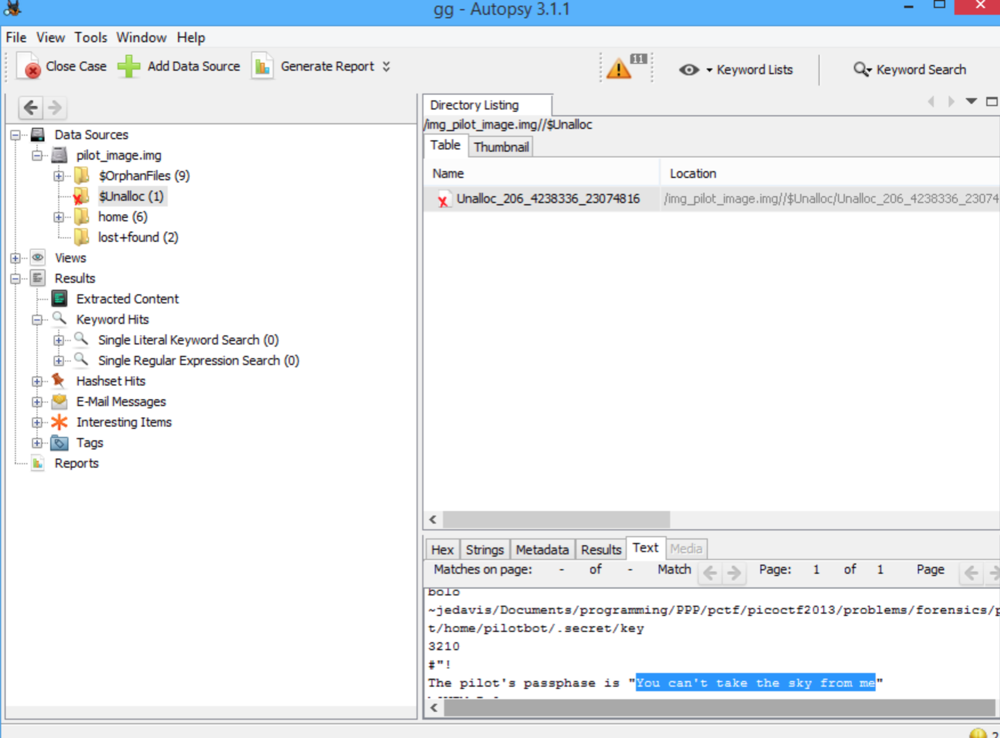

# pilot-logic

## 题目描述
```
You've gotten a partial dump of the disk from the hangar's machine, and you're pretty sure the pilot's password is cleverly hidden somewhere within it...
解题链接： pilot_image
```

## 解题思路

题目让我们找pilot的密码，直接使用命令就可以知道password。

```bash
strings pilot_image| grep pass
```


The pilot's passphase is "You can't take the sky from me"

或使用软件`autopsy`。

> Autopsy® is a digital forensics platform and graphical interface to The Sleuth Kit® and other digital forensics tools. It is used by law enforcement, military, and corporate examiners to investigate what happened on a computer. You can even use it to recover photos from your camera's memory card.

