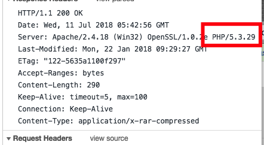
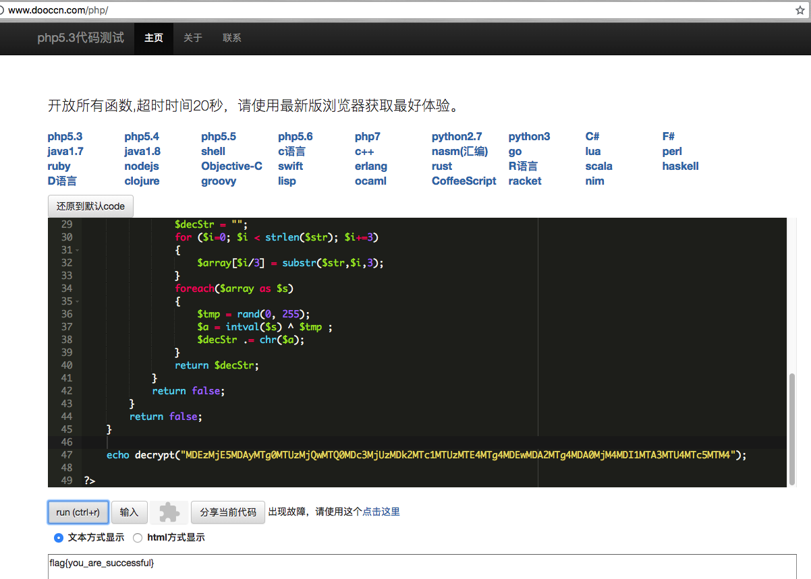

# 你没有见过的加密！

## 题目描述
```
MDEzMjE5MDAyMTg0MTUzMjQwMTQ0MDc3MjUzMDk2MTc1MTUzMTE4MTg4MDEwMDA2MTg4MDA0MjM4MDI1MTA3MTU4MTc5MTM4
MjUyMTUxMDQzMDI3MDQwMTg3MTc2MTQ3MTU2MTMyMDQzMDI5MDM3MjE0MDg4MTExMDE1MDU4MjM3MjE3MTIyMDQxMjM2MTQz
请喜欢linux的你，自己动手写出解密代码吧
格式：flag{ }
解题链接： test.rar
```

## 解题思路
打开附件，看到加密算法，直接写解密算法，这里有一个坑，不同版本，不同操作系统的php对`srand`种子后的随机值生成序列不一样，这也导致了很多人解不出来flag。

我也找了用了几个虚机测了几个版本都出不来，急中生智，找了个在线的php运行工具，找到了对应版本5.3，版本号是从访问题目附件的返回包里找的。



```php
<?php


	function encrypt($str)
	{
		$cryptedstr = "";
		srand(3284724);
		for ($i =0; $i < strlen($str); $i++)
		{
			$tmp = rand(0, 255);
			$temp = ord(substr($str,$i,1)) ^ $tmp;
			while(strlen($temp)<3)
			{
				$temp = "0".$temp;
			}
			$cryptedstr .= $temp. "";
		}
		return base64_encode($cryptedstr);
	}

	function decrypt($str)
	{
		srand(3284724);
		if(preg_match('%^[a-zA-Z0-9/+]*={0,2}$%',$str))
		{
			$str = base64_decode($str);
			if ($str != "" && $str != null && $str != false)
			{
				$decStr = "";
				for ($i=0; $i < strlen($str); $i+=3)
				{
					$array[$i/3] = substr($str,$i,3);
				}
				foreach($array as $s)
				{
					$tmp = rand(0, 255);
					$a = intval($s) ^ $tmp ;
					$decStr .= chr($a);
				}
				return $decStr;
			}
			return false;
		}
		return false;
	}
	echo decrypt("MDEzMjE5MDAyMTg0MTUzMjQwMTQ0MDc3MjUzMDk2MTc1MTUzMTE4MTg4MDEwMDA2MTg4MDA0MjM4MDI1MTA3MTU4MTc5MTM4");	
?>
```

在线运行网站`http://www.dooccn.com/php/`。



flag{you_are_successful}