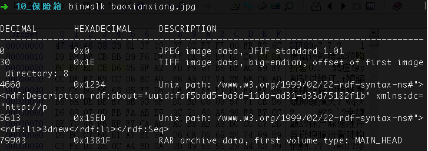
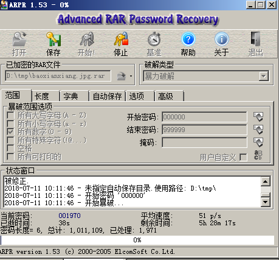
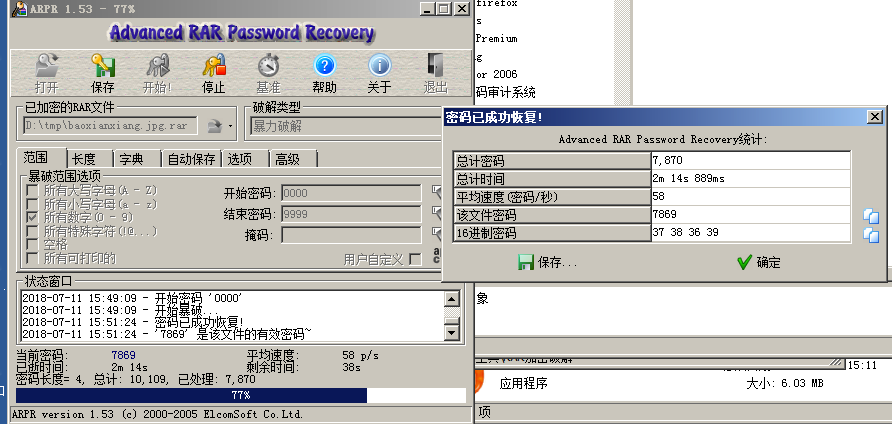

# 保险箱

## 题目描述
```
小明有一个保险箱，里面珍藏了小明的日记本，他记录了什么秘密呢？
格式：flag{}
```

## 解题思路
使用binwalk看一下文件，发现存在rar。



使用dd抠出来，`dd if=baoxianxiang.jpg of=baoxianxiang.jpg.rar skip=79903 bs=1`，抠出来之后，发现`rar`是加密的。使用arpr破解。





找到密码`7869`。

flag{75a3d68bf071ee188c418ea6cf0bb043}