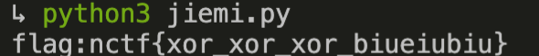

# 异性相吸

## 题目描述
```
解密吧，附件yx.zip
```

## 解题思路

解压附件后，发现存在`密文`，`明文`两个文件。
明文和密文进行异或得出flag

```python
with open("明文.txt") as f1:
    a = f1.read()
with open("密文.txt") as f2:
    b = f2.read()
 
key = ''
for i in range(len(a)):
    key += chr(ord(list(a)[i]) ^ ord(list(b)[i]))
print(key)
```



flag:nctf{xor_xor_xor_biueiubiu}
