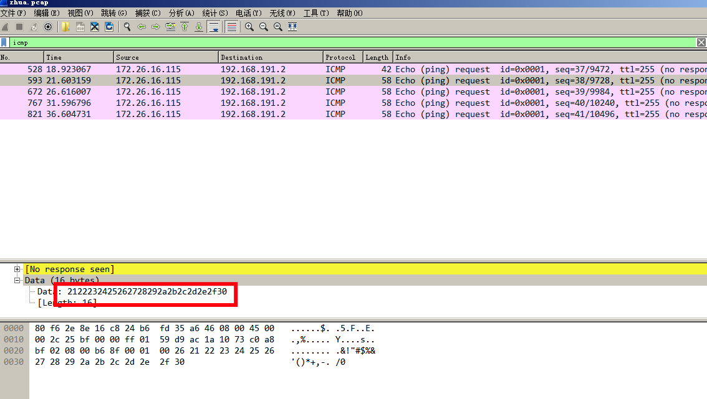

# 抓到你了

## 题目描述
```
Hint：入侵者通过 ping 工具对局域网内一主机进行存活性扫描， flag 为入侵所 发送的 16 字节的数据包内容。
解题链接： zhua
```

## 解题思路
附件是一个流量包，改后缀名为`.pcap`使用`wireshark`打开，题目提示的flag为ping包，则查找`icmp`协议内容，看数据，发现一个只有5个`icmp`包，每个包的数据段都都有一样的16字节数据，确认为flag。



2122232425262728292a2b2c2d2e2f30