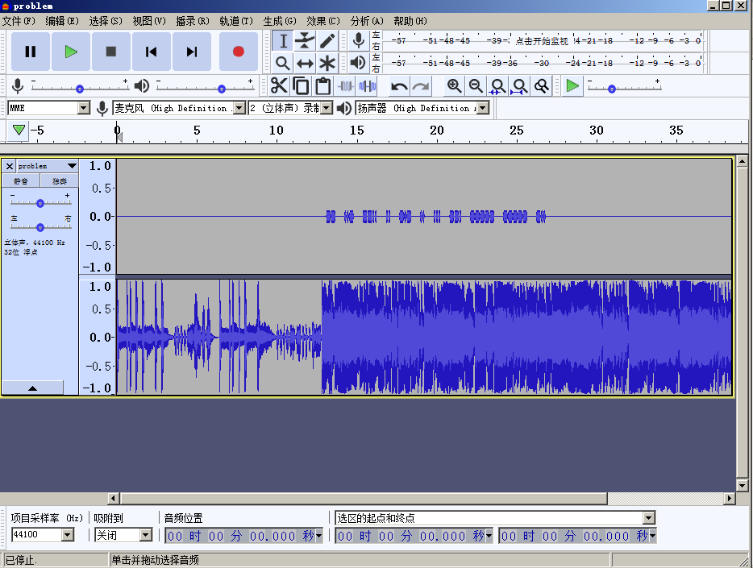
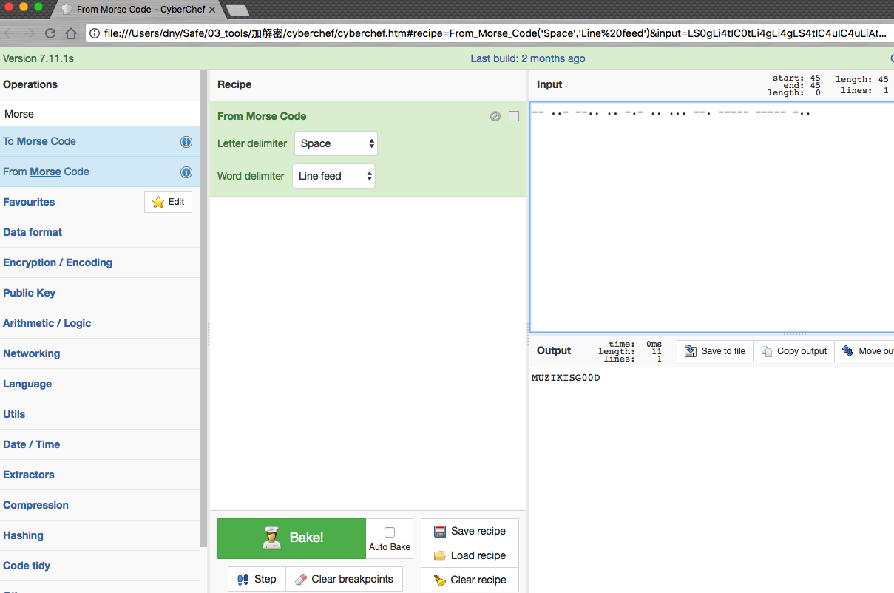

# 理查德

## 题目描述
```
首先你得认识它
格式：CTF{}
```

## 解题思路

`problem.flac`是一个音频文件，推测要进行音频分析。使用[Audacity](https://www.fosshub.com/Audacity.html/audacity-win-2.2.2.exe)进行音频分析。


可以明显看到上面的音轨是类似于摩斯码的东西，长的为`-`，短的为`.`。


打印出来`-- ..- --.. .. -.- .. ... --. ----- ----- -..`，解密。


CTF{MUZIKISG00D}