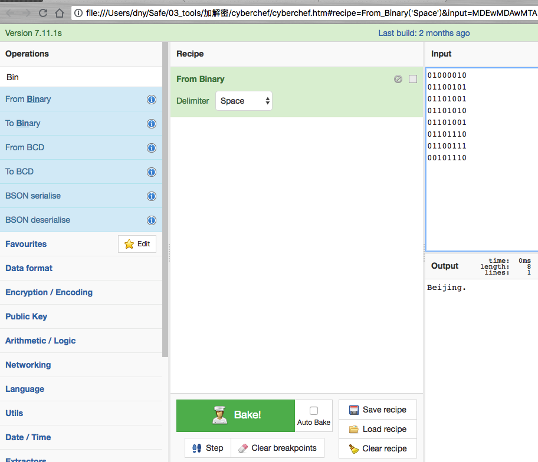
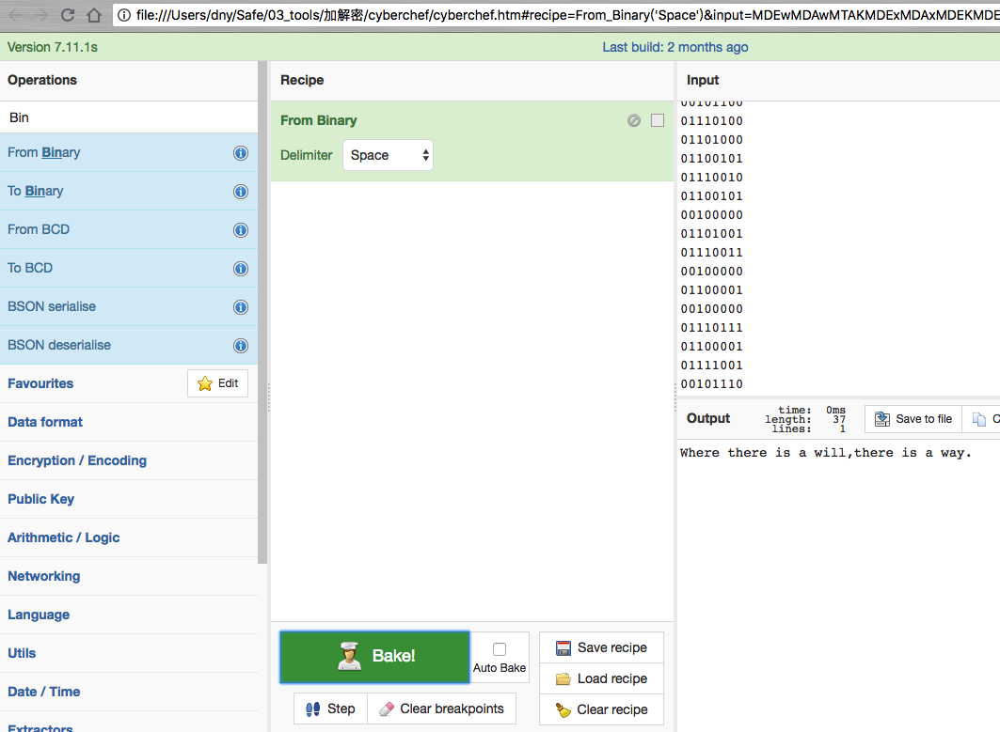

# 解码磁带

## 题目描述
```
在这圈磁带上有一些字符'o'和下划线'_'。解码磁带
格式：simCTF{ }
```

## 解题思路

看到题目密文，由于已经给出了一段为`Beijing.`,猜测是用`o`和`_`替换了`0`,`1`，经过测试，是使用了`o`替换`1`，`_`替换`0`。推荐一个解密神器，叫做`cyberchef`，很好用，下面就用这个工具演示如何解密。



```
01000010
01100101
01101001
01101010
01101001
01101110
01100111
00101110 
```

然后把需要解密的密文替换之后放入。



```
01010111
01101000
01100101
01110010
01100101
00100000
01110100
01101000
01100101
01110010
01100101
00100000
01101001
01110011
00100000
01100001
00100000
01110111
01101001
01101100
01101100
00101100
01110100
01101000
01100101
01110010
01100101
00100000
01101001
01110011
00100000
01100001
00100000
01110111
01100001
01111001
00101110 
```

这是网上搜的一个解密文档，使用python进行解密，有兴趣的可以自己进行尝试。

```python
#coding=UTF-8
filename='2.txt'
with open(filename,'r') as file:
    lines=file.readlines()
n=len(lines)
i=0

# 将o_码转为二进制码并写入文档
for i in range(0,n):
    lines[i].rstrip('\n')
    lines[i]=lines[i].replace('o','0')
    lines[i]=lines[i].replace('_','1')
with open(filename,'a') as file:
    file.write('\n\n')
    for line in lines:
        file.write(line)

# 网上扒的一个将二进制串转为字符串的函数
def decode(s):
    return ''.join([chr(m) for m in [int(b, 2) for b in s.split(' ')]])

for i in range(0,n):
    lines[i]=decode(lines[i])

# 将解码后的字符串写入文档
with open(filename,'a') as file:
    file.write('\n\n')
    for line in lines:
        file.write(line)
```