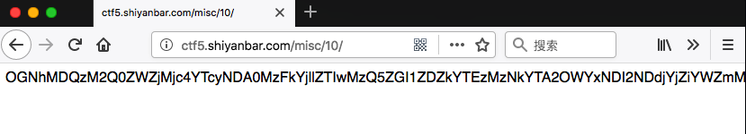
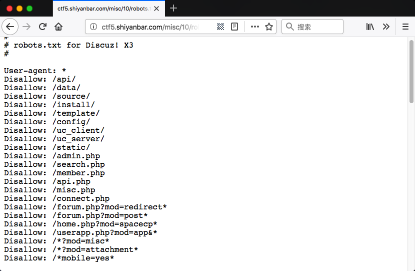
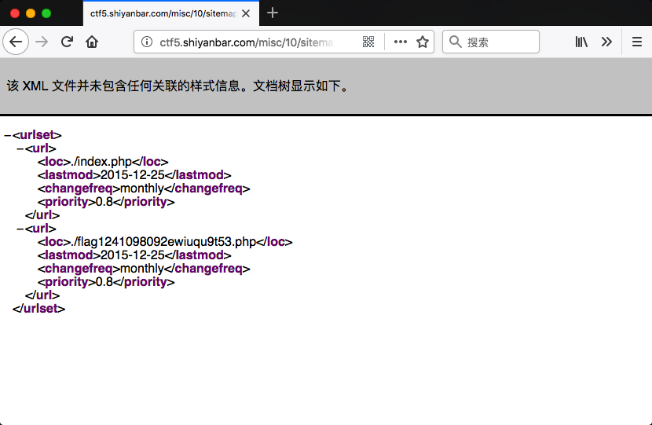

# 题目名称
雌黄出其唇吻

## 题目描述
```
怎么好像就是在随机产生？莫非不是这个？
格式：CTF{}

http://ctf5.shiyanbar.com/misc/10
```

## 解题思路

这里显示了一些奇异的字符，看不出是什么编码,且每次点击这个链接出现的字符都不一样。



看来要另寻他路去解这道题，在该链接后面加上robots.txt看看有什么：



最后有一条`Sitemap: ./sitemap87591u096080.xml`，看一下。



有链接`http://ctf5.shiyanbar.com/misc/10/flag1241098092ewiuqu9t53.php`，访问后拿到密文`NGFiYWZiQ1RGe3JvYm90c19jb3VsZF9sZWFrX2luZm9ybWF0aW9ufTkzNTljNg==`，解密得到`4abafbCTF{robots_could_leak_information}9359c6`。