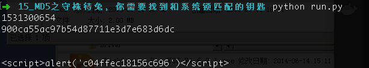

# MD5之守株待兔，你需要找到和系统锁匹配的钥匙

## 题目描述
```
从系统锁下手，通过get方式key字段提交答案，直到您的钥匙与系统锁相等则成功。
格式：CTF{}
解题链接： http://ctf5.shiyanbar.com/misc/keys/keys.php
```

## 解题思路
先提交一下key试试，出来一串md5，用http://www.md5online.org/这个网站查一下发现，系统需要的md5是unix时间戳，然后写个代码提交时间戳：
```python
#!/usr/bin/env python
#-*- coding: utf-8 -*-
"""
@Author : darkN0te
@Create date : 2018-07-11
@description : MD5之守株待兔，你需要找到和系统锁匹配的钥匙
@Update date :   
"""  
import time
import requests
import hashlib

currTime = int(time.time())
print currTime

response = requests.get("http://ctf5.shiyanbar.com/misc/keys/keys.php?key=" + str(currTime))
print response.text
```


flag : c04ffec18156c696
