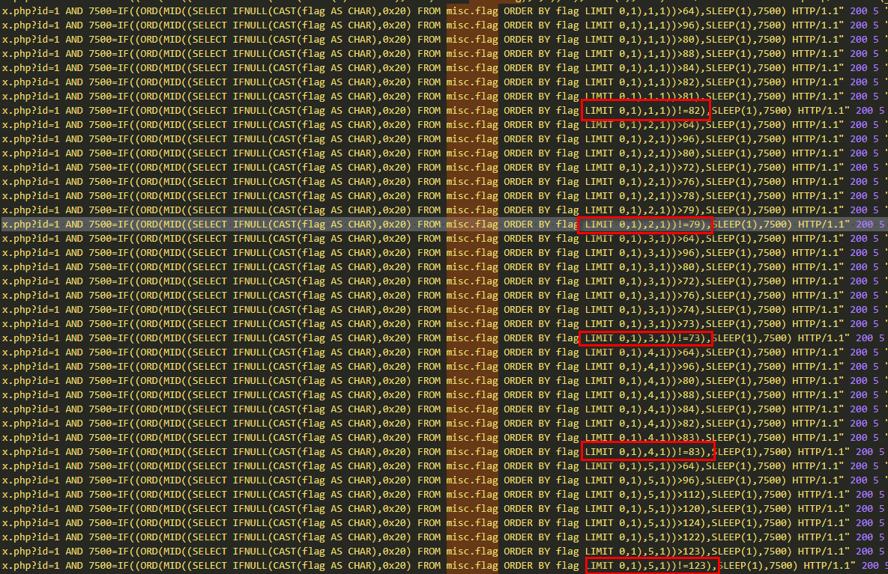

# Nginx日志分析

## 题目描述
```
Analysis nginx's log(this flag is like ROIS{xxx})
```

## 解题思路
解压附件log_log.rar，里面的文件是nginx日志，查看日志，可以发现里面有大量的sqlmap注入日志。

对日志简单进行分析，发现存在对`misc.flag`的盲注行为，下图标记的是盲注SQL语句判断当前内容成功的语句。



将这些ascii码全部提取得到

```
49 82 79 73 83 123 109 105 83 99 95 65 110 64 108 121 83 105 115 95 110 71 49 110 120 95 83 105 109 125 5,
```

解一下ascii编码得到字符串`1ROIS{miSc_An@lySis_nG1nx_Sim}.`

flag为`ROIS{miSc_An@lySis_nG1nx_Sim}`。