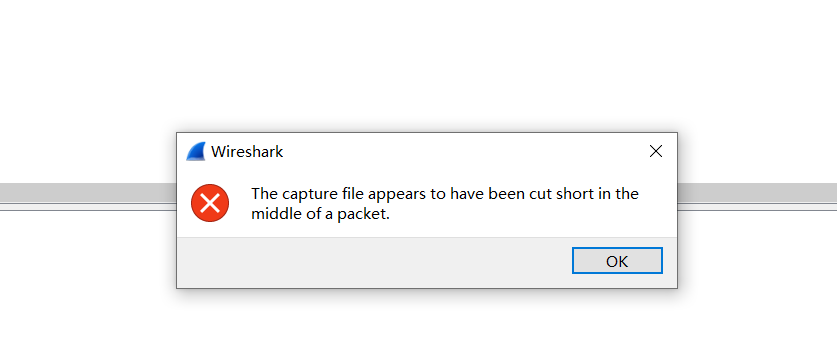
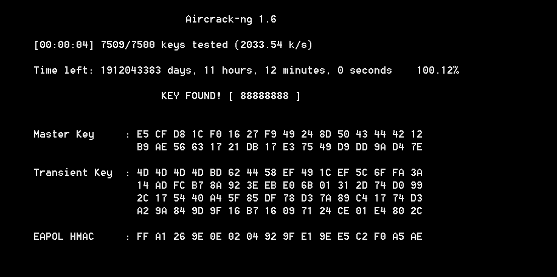
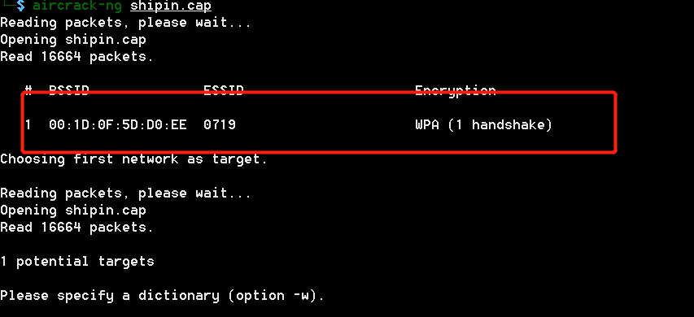
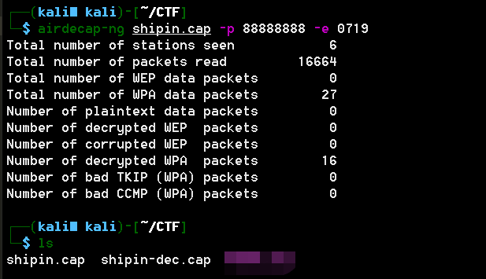
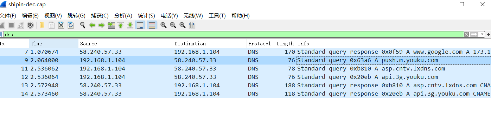

# A记录

## 题目描述
```
他在看什么视频，好像很好看，不知道是什么网站的。
还好我截取了他的数据包，找呀找。
key就是网站名称。格式ctf{key}
tip:A记录的第一条。
```

## 解题思路

下载下来是一个cap包，题目说的是查找网站名称，因此直接查找dns就可以了，

用wireshark打开，

报这个错误The capture file appears to have been cut short in the middle of a packet.

捕获文件似乎已经在一个数据包的中间被剪短了。不懂啥意思？？？，跳过



然后搜索dns啥也没有，而且数据包很小，解密cap包（需要ESSID和密码）

使用kali下自带的aircrack-ng就可以了，自己配置字典

```bash
aircrack-ng shipin.cap -w top10W.txt
```



密码`88888888`，查看具体的ssid



ssid为`0719`，解密流量包，使用airdecap-ng

```bash
airdecap-ng shipin.cap -p 88888888 -e 0719
```



打开流量，搜索dns，里面好几个网站，答案是其中之一

