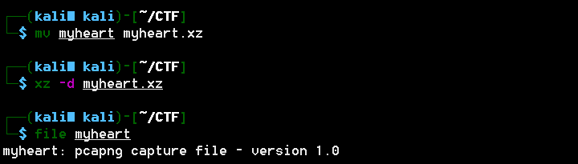
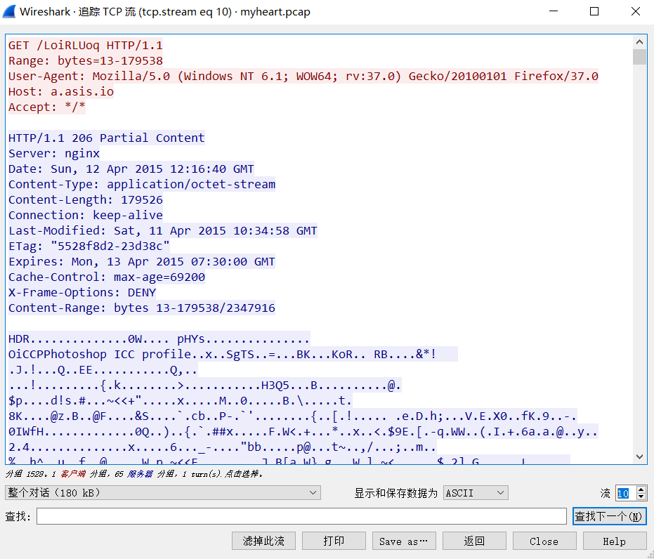

# Broken Heart

## 题目描述
```
find the flag in this file

附件myheart
```

## 解题思路

检测文件发现是xz文件


修改文件后缀，解压出流量包



打开流量包。看到了比较明显的HDR和Photoshop字样，说明在传输png文件，猜测我们需要还原图片文件。这里要注意的是tcp流的顺序并不对应图片的顺序，顺序的区分要根据‘Content-Range:’字段。一共有23个流文件，wireshark自带的导出HTTP对象并不包含http请求头和响应头的信息，所以没法批量导出了。而且做题的时候，懒得开虚拟机，windows上没有趁手的工具，我就手动把这23个流到出成了txt文件，选择上图显示和保存数据为：原始数据，然后save as就导出了。



然后对23个txt进行排序并写文件。首先我们发现最早的字节是从13开始的，也就是png文件头缺损，要把文件头补上。其次，这23个流不是严格的排序，有些传过的部分可能在别的数据包中也存在，区分一下就行了，脚本如下：

```python
import re
 
png_head = '\x89PNG\x0D\x0A\x1A\x0A\x00\x00\x00\x0DI'
 
# 获取数据包字节顺序信息
def get_index(flag=False):
    with open(filename, "rb") as f:
        data = f.read()
        rep = re.search(r'Content-Range: bytes (\d*)-(\d*)/(\d*)', data)
        if flag:
            return data, rep
        else:
            return rep
 
# 获取每个流的起始字节数
num = {}
for i in range(23):
    filename = str(i) + '.txt'
    idx = get_index()
    num[int(idx.group(1))] = i
newd = sorted(num.keys())
# 按流起始字节数逐个将流写入png文件
with open("new.png", "wb") as f:
    # 写入文件头
    f.write(png_head)
    # flag标志当前文件末字节数
    flag = 12
    while newd:
        filename = str(num[newd[0]]) + '.txt'
        data, rep = get_index(True)
        idx = rep.regs[-1][1] + 4
        tmp = int(rep.group(2))
        # 当前数据包已经被写入文件，不进行写操作
        if tmp < flag:
            newd.remove(newd[0])
            continue
        # 当前数据包被部分写入文件，从上个数据包末尾开始写操作
        elif newd[0] < flag:
            idx += flag - newd[0] + 1
        f.write(data[idx:])
        flag = tmp
        newd.remove(newd[0])
```

出来是一张图片，代码有点问题，没有跑出来，不浪费时间了。

---

找到另外一种更好的解决方案：

用wireshalk打开，选择file–>export objects–>HTTP，导出全部文件，修改第一个文件名为LoiRLUoq(0)，得到23个文件，将文件命名为LoiRLUoq(0)~LoiRLUoq(22)

linux中执行：

```
strings myheart.pcap | grep 'Content-Range' | awk '{print NR,$3}' > myheart.txt
```

输出到文件myheart.txt，将txt和导出的23个文件放在一个文件夹下
编写代码，输出到文件，后来观察头包含HDR，前面缺少13个字节，猜测可能是个PNG图片，补充PNG头的前13个字节。打开图片。

```python
f=open('myheart.txt','r')
x=list(f.readlines())
f.close()
listvalues=[]
indexlist=[]
for i in xrange(len(x)):
    d=x[i].split()[1].split('/')[0].split('-') #提取前后两个数
    flag=True
    for kline in listvalues:
        if (int(d[0])>=kline[0] and int(d[1])<=kline[1]):#若数在已存在的列表中，则取消存储
            flag=False
            break
    if flag:
        listvalues.append((int(d[0]),int(d[1])))#存储
        indexlist.append(i) #存储原顺序，以得到文件名

sortedpos=sorted([xx[0] for xx in listvalues]) #排序

fresult=open('resultx.png','wb')
fresult.write('89504E470D0A1A0A0000000D49'.decode('hex')) #写入png头，共13个字节
for i in xrange(len(sortedpos)):
    index=0
    for searchnums in listvalues:
        if(sortedpos[i]==searchnums[0]): #在存储的范围列表中找到位置序号
            break
        else:
            index+=1
    f=open('LoiRLUoq(%d)'%(indexlist[index]),'rb') #打开文件
    if(i!=len(sortedpos)-1):
        fresult.write(f.read()[:sortedpos[i+1]-sortedpos[i]])
    else:
        fresult.write(f.read())    
    f.close()
fresult.close()
print '执行完毕，请查看图片得到key'
```

正确的得到了Flag

