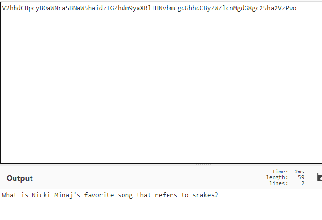
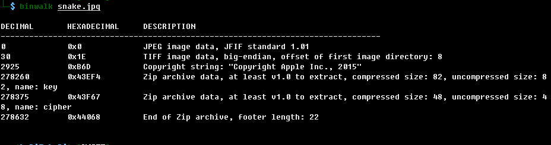
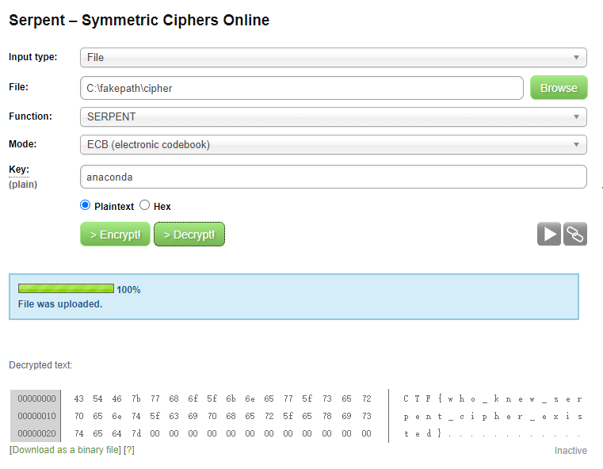

# Snake

## 题目描述
```
格式：CTF{}
```

## 解题思路

使用strings查看文件，发现存在特殊字符串`keyV2hhdCBpcyBOaWNraSBNaW5haidzIGZhdm9yaXRlIHNvbmcgdGhhdCByZWZlcnMgdG8gc25ha2VzPwo=`


删除key后，使用base64解出下面的话



What is Nicki Minaj's favorite song that refers to snakes?

使用binwalk查看文件，发现存在压缩包，提取文件



得到`cipher`和`key`，其中key就是上面的内容，使用百度查找答案是`anaconda`。

接下来要考虑的就是加密的方式了，与蛇有关的，百度到serpent加密，在这里http://serpent.online-domain-tools.com/解密。


