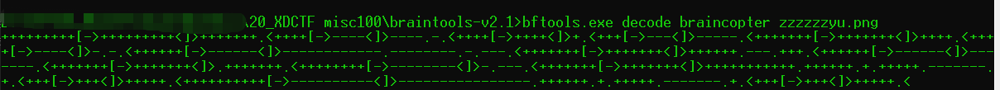
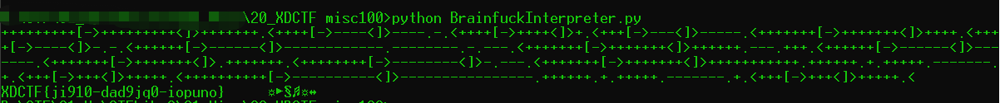

# XDCTF misc100


## 题目描述
```
braintools
附件photos.rar
```

## 解题思路

使用`braintools-v2.1`可以直接解出

```
bftools.exe decode braincopter zzzzzzyu.png
+++++++++[->+++++++++<]>+++++++.<++++[->----<]>----.-.<++++[->++++<]>+.<+++[->---<]>-----.<+++++++[->+++++++<]>++++.<++++[->----<]>-.-.<++++++[->------<]>------------.--------.-.---.<+++++++[->+++++++<]>++++++.---.+++.<++++++[->------<]>-------.<+++++++[->+++++++<]>.+++++++.<++++++++[->--------<]>-.---.<+++++++[->+++++++<]>+++++++++++.++++++.+.+++++.-------.+.<+++[->+++<]>+++++.<++++++++++[->----------<]>----------------.++++++.+.+++++.-------.+.<+++[->+++<]>+++++.<
```



在使用`BrainfuckInterpreter.py`解出flag



XDCTF{ji910-dad9jq0-iopuno}