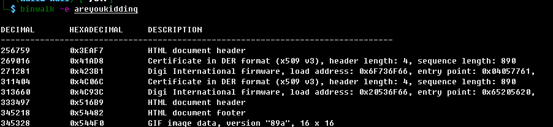
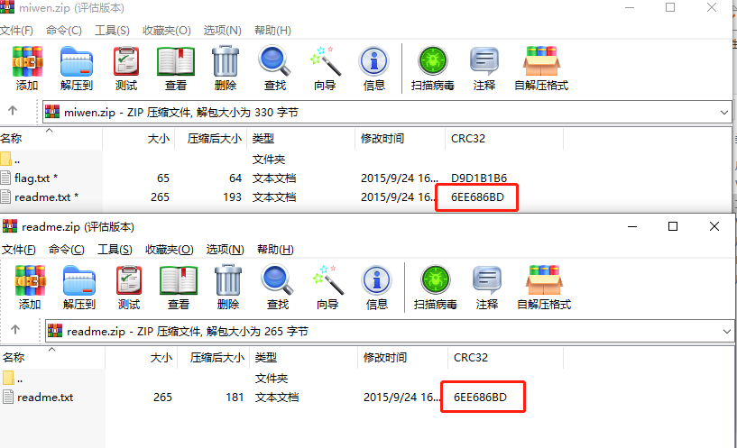
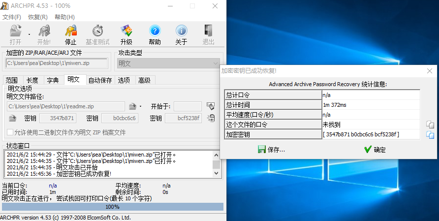
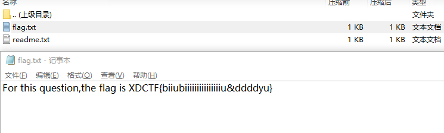

# XDCTF misc200

## 题目描述
```
明文攻击

格式：XDCTF{ }
附件：areyoukidding
```

## 解题思路

将`areyoukidding`使用binwalk提取文件，找到两个zip



可以看到含有flag的文件中有readme.txt，但是这些文件加密了。但是在另外一个压缩包中，存在readme.txt的明文。可知使用zip明文攻击。







For this question,the flag is XDCTF{biiubiiiiiiiiiiiiiiiu&ddddyu}