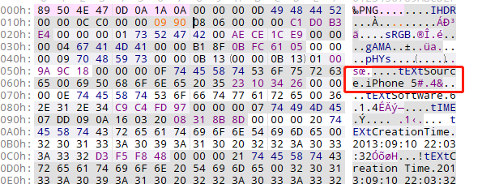
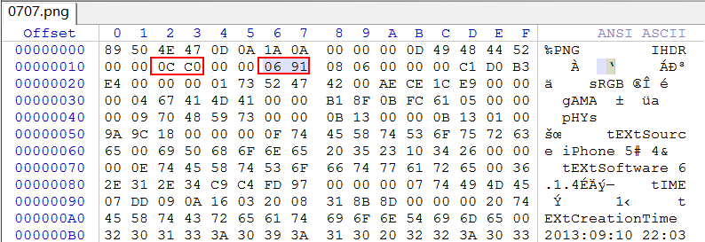
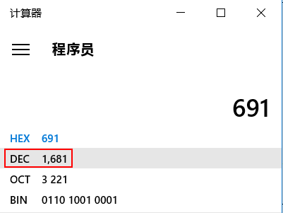

# deeeeeeaaaaaadbeeeeeeeeeef

## 题目描述
```
图片是正确的吗？
```

## 解题思路

这道题很有意思，常规的隐写思路没有线索，结果问题出现在照片的分辨率上，tEXtSource iPhone 5的后置摄像头是3264×2448的分辨率，前置摄像头是960×1280







而这张图片只有3264*1681，显然是后面错了，修改为0x990还原当时的分辨率key就出现了，好神奇。

