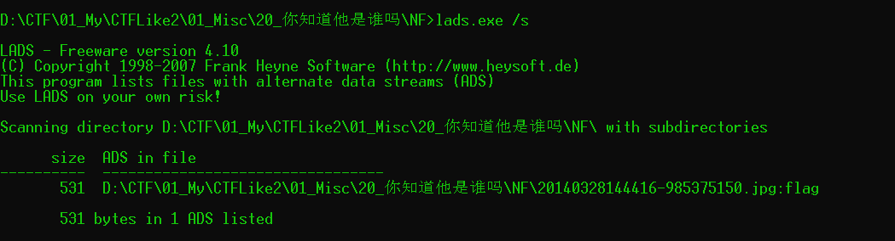
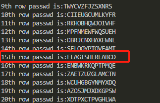

# 你知道他是谁吗

## 题目描述
```
windows，winrar
key值：flag{xxxxx}(大写)
解题链接： http://ctf5.shiyanbar.com/misc/NF/NF.rar
```

## 解题思路

**作者使用NTFS交换数据流隐藏了一个文件在20140328144416-985375150.jpg文件中**

题目中给了两个提示，是windows和winrar，如果做到过类似的题，就会想到这题可能是NTFS交换数据隐写。

NTFS交换数据流（alternate data streams，简称ADS）是NTFS磁盘格式的一个特性，在NTFS文件系统下，每个文件都可以存在多个数据流，就是说除了主文件流之外还可以有许多非主文件流寄宿在主文件流中。它使用资源派生来维持与文件相关的信息，虽然我们无法看到数据流文件，但是它却是真实存在于我们的系统中的。创建一个数据交换流文件的方法很简单，命令为"宿主文件:准备与宿主文件关联的数据流文件"。具体[使用方法](https://www.qingsword.com/qing/812.html#windows-NTFS-ADS-5)看这里。

回到题目中，首先用`winrar`解压NF.zip,只有一张照片，照片中人物是美国第三任总统托马斯·杰斐逊，他发明了杰斐逊转轮加密器，说明这道题目很可能跟这种加密方式有关。

用lads检测当前目录下的交换数据流，streams可以清除相关数据流，不过这次我们用不到。使用lads可以检测到两个ADS区。注意，一定要使用winrar解压压缩包。



使用16进制编辑工具编辑这个工具 `notepad .\20140328144416-985375150.jpg:flag`

获取到新的信息

```
1.<ZWAXJGDLUBVIQHKYPNTCRMOSFE <
2.<KPBELNACZDTRXMJQOYHGVSFUWI <
3.<BDMAIZVRNSJUWFHTEQGYXPLOCK <
4.<RPLNDVHGFCUKTEBSXQYIZMJWAO <
5.<IHFRLABEUOTSGJVDKCPMNZQWXY <
6.<AMKGHIWPNYCJBFZDRUSLOQXVET <
7.<GWTHSPYBXIZULVKMRAFDCEONJQ <
8.<NOZUTWDCVRJLXKISEFAPMYGHBQ <
9.<QWATDSRFHENYVUBMCOIKZGJXPL <
10.<WABMCXPLTDSRJQZGOIKFHENYVU <
11.<XPLTDAOIKFZGHENYSRUBMCQWVJ <
12.<TDSWAYXPLVUBOIKZGJRFHENMCQ <
13.<BMCSRFHLTDENQWAOXPYVUIKZGJ <
14.<XPHKZGJTDSENYVUBMLAOIRFCQW <

密钥：1,2,5,7,9,11,14,3,4,6,8,10,12,13

密文：BQKUTPVDKYUQVU
```

根据`杰裴逊转轮加密器`原理，最上面的14行是为了传输信息的，每一行都是26个字母。

传送信息时，通过转动转轮让其中的一列变成要传达的信息，然后抄写其他的25列中的任意一列作为密文，再打乱转轮。发送方同时将密文和密码器传递给接收方。

接收消息时，通过转动转轮让其中的一列变成密文，然后依次查看其余25列是否有想要得到的信息即可。

在本题中，多了一个密钥位，这个密钥可以理解成为密码器行的顺序，就是说将密码器转动为相应的密文后，按这个密钥的顺序读取指定行，就是先读第一行，然后第二行，然后第五行。。。这样来还原所要传递的信息。

根据如上分析，我们可以写出如下python代码对其进行解码

```python
#存储密码器
jwc=['ZWAXJGDLUBVIQHKYPNTCRMOSFE',
     'KPBELNACZDTRXMJQOYHGVSFUWI',
     'BDMAIZVRNSJUWFHTEQGYXPLOCK',
     'RPLNDVHGFCUKTEBSXQYIZMJWAO',
     'IHFRLABEUOTSGJVDKCPMNZQWXY',
     'AMKGHIWPNYCJBFZDRUSLOQXVET',
     'GWTHSPYBXIZULVKMRAFDCEONJQ',
     'NOZUTWDCVRJLXKISEFAPMYGHBQ',
     'QWATDSRFHENYVUBMCOIKZGJXPL',
     'WABMCXPLTDSRJQZGOIKFHENYVU',
     'XPLTDAOIKFZGHENYSRUBMCQWVJ',
     'TDSWAYXPLVUBOIKZGJRFHENMCQ',
     'BMCSRFHLTDENQWAOXPYVUIKZGJ',
     'XPHKZGJTDSENYVUBMLAOIRFCQW']
#存储密钥
c_k = [1,2,5,7,9,11,14,3,4,6,8,10,12,13]
#存储密文
c_t = 'BQKUTPVDKYUQVU'
#将密码器与密钥对应
c_list = [jwc[x-1] for x in c_k]
#转动密码器以还原密文
for i in range(len(c_t)):
    index = c_list[i].find(c_t[i])
    c_list[i] = c_list[i][index:]+c_list[i][:index]
#循环输出各列的信息，寻找符合的一项即可
for i in range(26):
    row = []
    for j in range(14):
        row.append(c_list[j][i])
    print "%dth row passwd is:%s"%(i,''.join(row))
```


