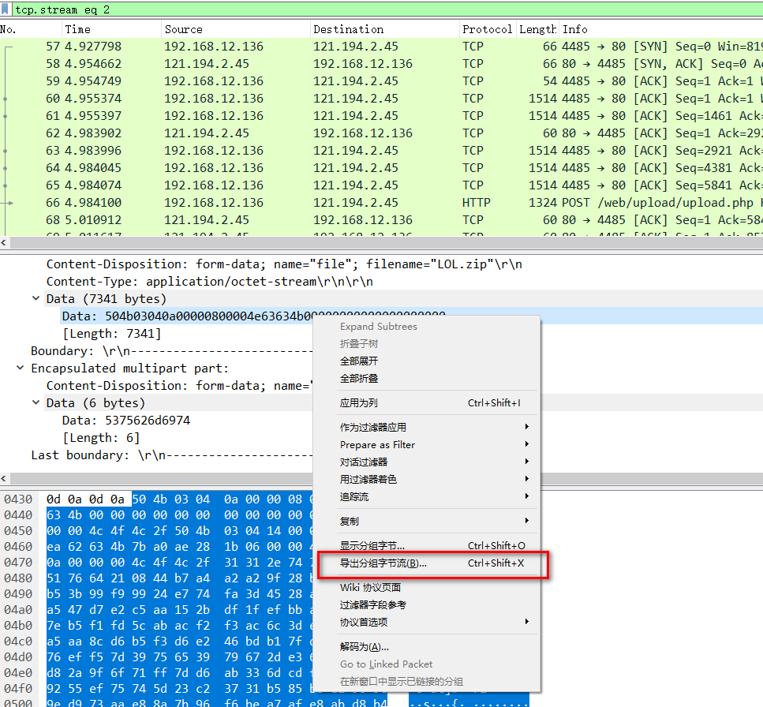
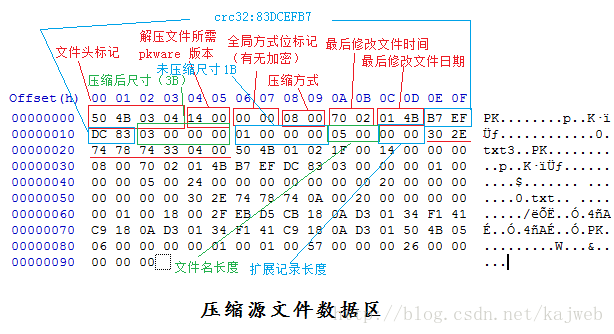
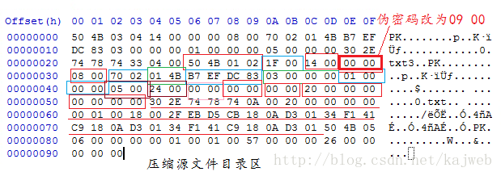
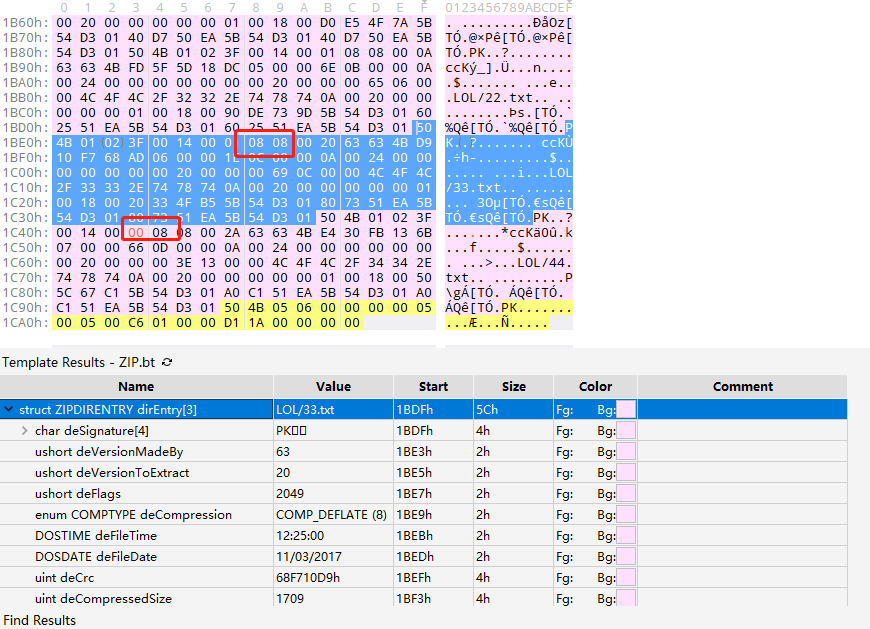
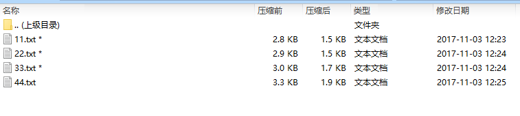
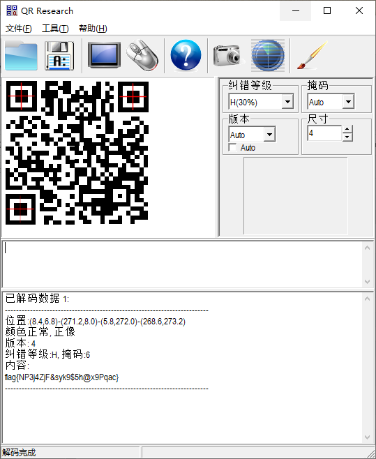

# 啦啦啦

## 题目描述
```
隐藏在数据包中的秘密
解题链接： http://ctf5.shiyanbar.com/misc/LOL/LOL.pcapng
```

## 解题思路

将流量分析后，发现用户上传了两个文件lol.zip和lol.docx，其中lol.docx一通分析没有内容，所以主要分析lol.zip文件。使用下图方式导出文件。



导出的lol.zip文件进行了加密，猜测是伪加密，伪加密是将zip文件的加密标志位进行了修改，实际上文件并没有加密。下面是伪加密的原理。





```
压缩源文件数据区：
50 4B 03 04：这是头文件标记（0x04034b50）
14 00：解压文件所需 pkware 版本
00 00：全局方式位标记（有无加密）
08 00：压缩方式
5A 7E：最后修改文件时间
F7 46：最后修改文件日期
16 B5 80 14：CRC-32校验（1480B516）
19 00 00 00：压缩后尺寸（25）
17 00 00 00：未压缩尺寸（23）
07 00：文件名长度
00 00：扩展记录长度

压缩源文件目录区：
50 4B 01 02：目录中文件文件头标记(0x02014b50)
3F 00：压缩使用的 pkware 版本
14 00：解压文件所需 pkware 版本
00 00：全局方式位标记（有无加密，这个更改这里进行伪加密，改为09 00打开就会提示有密码了）
08 00：压缩方式
5A 7E：最后修改文件时间
F7 46：最后修改文件日期
16 B5 80 14：CRC-32校验（1480B516）
19 00 00 00：压缩后尺寸（25）
17 00 00 00：未压缩尺寸（23）
07 00：文件名长度
24 00：扩展字段长度
00 00：文件注释长度
00 00：磁盘开始号
00 00：内部文件属性
20 00 00 00：外部文件属性
00 00 00 00：局部头部偏移量

压缩源文件目录结束标志：
50 4B 05 06：目录结束标记
00 00：当前磁盘编号
00 00：目录区开始磁盘编号
01 00：本磁盘上纪录总数
01 00：目录区中纪录总数
59 00 00 00：目录区尺寸大小
3E 00 00 00：目录区对第一张磁盘的偏移量
00 00：ZIP 文件注释长度
```

### 识别真假加密
压缩源文件数据区的全局加密应当为00 00 
且压缩源文件目录区的全局方式位标记应当为00 00


### 识别假加密
压缩源文件数据区的全局加密应当为00 00 
且压缩源文件目录区的全局方式位标记应当为09 00


### 识别真加密
压缩源文件数据区的全局加密应当为09 00 
且压缩源文件目录区的全局方式位标记应当为09 00 


本题目中将4个文件11.txt 22.txt 33.txt 44.txt的伪加密标志位全部置位`00 08`



只修改其中一个后的样式



除了使用手工的方法，还可以使用ZipCenOp.jar直接破解伪加密

```bash
# java -jar ZipCenOp.jar e xxx.zip 加密
# java -jar ZipCenOp.jar r xxx.zip 解密
 
java -jar ZipCenOp.jar r lol.zip
```

查看内容应该是图片的ascii模式，将四个文本转成图片。发现4张图片可以组合成为二维码




flag{NP3j4ZjF&syk9$5h@x9Pqac}