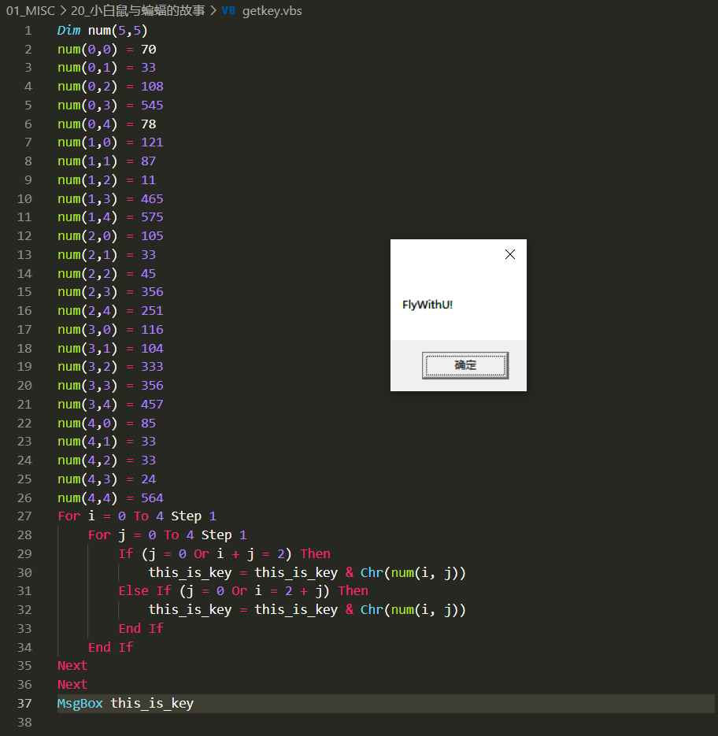

# 小白鼠与蝙蝠的故事

## 题目描述
```
小白鼠喜欢上了一只蝙蝠，天天想着这个空姐，难以入眠
解题链接： http://ctf5.shiyanbar.com:8080/1/index.html


小白鼠喜欢上了一只蝙蝠，天天想着这个空姐，难以入眠。

终于有一天，空姐知道了，就给了小白鼠一个机会，叫他处理一个脚本，得到里面的Key。

这可是个好机会，小白鼠赶紧打开文件，经过一阵%@￥#%@……￥@&#×@（。。。。

最后小白鼠找到了Key。空姐为了感谢他就载着它在天空飞行。


你想飞行吗？

```

## 解题思路

题目原生给出的`code.vbs`，发现中间的code是每9位做了一个字符串翻转，文件如下。

```vb
code="5(mun miD0(mun:)5,:07 = )0, )1,0(mun(mun:33 =01 = )2,03,0(mun:8un:545 =) = )4,0(m,1(mun:87:121 = )0 )1,1(mun(mun:78 =11 = )2,1)3,1(mun:mun:564 =5 = )4,1(,2(mun:57:501 = )0 )1,2(mun(mun:33 =54 = )2,2)3,2(mun:mun:653 =2 = )4,2(,3(mun:15:611 = )0 )1,3(munmun:401 =3 = )2,3(,3(mun:33n:653 =)3= )4,3(mu(mun:754 58 = )0,4)1,4(mun:mun:33 = 3 = )2,4(3,4(mun:3mun:42 =)  = )4,4(i roF:4654 oT 0 = F:1 petS  0 = j ropetS 4 oT j( fI:1  i rO 0 =T )2= j +_siht:neh = yek_sik_si_siht(rhC & ye)j ,i(munfI eslE:)O 0 = j( + 2 = i r nehT )j _si_siht:iht = yek yek_si_smun(rhC &E:))j ,i(dne:fI dn:txeN:fi BgsM:txeN_siht"" xoR:""yek_si:ezimodnatnI = yek)2+8*dnR(ver=edoc:peR=edoc:edoc(ecal,)43(rhC,C+)43(rhCS:))43(rhrC=osa tecejbOetae.bdoda""(t:)""maerts:osa htiwrw.:nepo."" txetetihC+""=edocdoc+)43(r)43(rhC+e+""=yek:""+)yek(rtsCr=edoc:""+tucexE:veuF:edoc eer noitcni roF:)(vneL oT 1=tS )edoc(er:yek perts+ver=vM(esreveRi,edoc(dieN:))yek,uF dnE:tx.:""noitcnlifotevastpircsw euftpircs.:2,emanll:htiw dne":key=9:code=rev:Execute code:Function rev():For i=1 To Len(code) Step key:rev=rev+strReverse(Mid(code,i,key)):Next:End Function
```

将代码中的`Execute code`删除，并添加写入函数，成为文件`恢复code.vbs`，文件如下。

```vb
code="5(mun miD0(mun:)5,:07 = )0, )1,0(mun(mun:33 =01 = )2,03,0(mun:8un:545 =) = )4,0(m,1(mun:87:121 = )0 )1,1(mun(mun:78 =11 = )2,1)3,1(mun:mun:564 =5 = )4,1(,2(mun:57:501 = )0 )1,2(mun(mun:33 =54 = )2,2)3,2(mun:mun:653 =2 = )4,2(,3(mun:15:611 = )0 )1,3(munmun:401 =3 = )2,3(,3(mun:33n:653 =)3= )4,3(mu(mun:754 58 = )0,4)1,4(mun:mun:33 = 3 = )2,4(3,4(mun:3mun:42 =)  = )4,4(i roF:4654 oT 0 = F:1 petS  0 = j ropetS 4 oT j( fI:1  i rO 0 =T )2= j +_siht:neh = yek_sik_si_siht(rhC & ye)j ,i(munfI eslE:)O 0 = j( + 2 = i r nehT )j _si_siht:iht = yek yek_si_smun(rhC &E:))j ,i(dne:fI dn:txeN:fi BgsM:txeN_siht"" xoR:""yek_si:ezimodnatnI = yek)2+8*dnR(ver=edoc:peR=edoc:edoc(ecal,)43(rhC,C+)43(rhCS:))43(rhrC=osa tecejbOetae.bdoda""(t:)""maerts:osa htiwrw.:nepo."" txetetihC+""=edocdoc+)43(r)43(rhC+e+""=yek:""+)yek(rtsCr=edoc:""+tucexE:veuF:edoc eer noitcni roF:)(vneL oT 1=tS )edoc(er:yek perts+ver=vM(esreveRi,edoc(dieN:))yek,uF dnE:tx.:""noitcnlifotevastpircsw euftpircs.:2,emanll:htiw dne":key=9:code=rev:msgbox code:Function rev():For i=1 To Len(code) Step key:rev=rev+strReverse(Mid(code,i,key)):Next
:msgbox rev   '弹出code变量
:Set objfso=CreateObject("scripting.filesystemobject")  '创建对象
:Set objTextFile = objfSO.OpenTextFile ("./code.txt",2,True) '创建文件
:objTextFile.Write(rev) '向文件写入code变量Next:End Function
:End Function
```

执行`恢复code.vbs`，得到真实的源码，如下。

```vb
Dim num(5,5):num(0,0) = 70:num(0,1) = 33:num(0,2) = 108:num(0,3)= 545:num(0,4) = 78:num(1,0) = 121:num(1,1) = 87:num(1,2) = 11:num(1,3)= 465:num(1,4) = 575:num(2,0) = 105:num(2,1) = 33:num(2,2) = 45:num(2,3)= 356:num(2,4) = 251:num(3,0) = 116:num(3,1) = 104:num(3,2) = 333:num(3,3)= 356:num(3,4) = 457:num(4,0) = 85:num(4,1) = 33:num(4,2) = 33:num(4,3)= 24:num(4,4) =  564:For i = 0 To 4 Step 1:For j = 0 To 4 Step 1:If (j = 0 Or i + j =2) Then:this_is_key = this_is_key & Chr(num(i, j)):Else If (j = 0 Or i = 2 + j) Then :this_is_key = this_is_key & Chr(num(i, j)):End If:end if:Next:Next:MsgBox "this_is_key":Randomize:key = Int(Rnd*8+2):code=rev:code=Replace(code,Chr(34),Chr(34)+Chr(34)):Set aso=CreateObject("adodb.stream"):with aso:.open:.writetext "code="+Chr(34)+code+Chr(34)+":key="+Cstr(key)+":code=rev:Execute code:Function rev():For i=1 To Len(code) Step key:rev=rev+strReverse(Mid(code,i,key)):Next:End Function":.savetofile wscript.scriptfullname,2:end with:
```

查看源码，定义了一个二维数组，然后对二位数组进行计算获得真正的key。制作获取key的源码`getkey.vbs`

```vb
Dim num(5,5)
num(0,0) = 70
num(0,1) = 33
num(0,2) = 108
num(0,3) = 545
num(0,4) = 78
num(1,0) = 121
num(1,1) = 87
num(1,2) = 11
num(1,3) = 465
num(1,4) = 575
num(2,0) = 105
num(2,1) = 33
num(2,2) = 45
num(2,3) = 356
num(2,4) = 251
num(3,0) = 116
num(3,1) = 104
num(3,2) = 333
num(3,3) = 356
num(3,4) = 457
num(4,0) = 85
num(4,1) = 33
num(4,2) = 33
num(4,3) = 24
num(4,4) = 564
For i = 0 To 4 Step 1
    For j = 0 To 4 Step 1
        If (j = 0 Or i + j = 2) Then
            this_is_key = this_is_key & Chr(num(i, j))
        Else If (j = 0 Or i = 2 + j) Then
            this_is_key = this_is_key & Chr(num(i, j))
        End If
    End If
Next
Next
MsgBox this_is_key
```

执行后得到key  FlyWithU!

