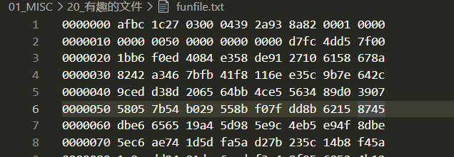
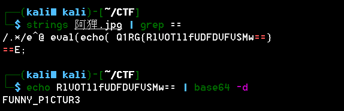

# 有趣的文件

## 题目描述
```
这是一个有趣的文件，打开看看你能想到什么
funfile
```

## 解题思路

文件内容



这道题的文件一看文件内容的格式就知道是一个bytes文件，于是写一个脚本将其写为bytes文件。看到输出的文件的内容，感觉像是某种格式的文件，但是文件头`AFBC 1C27`，从未见过，在网上搜索也没有什么发现。无意中想到文件格式的大小端，于是按搜索`BCAF 271C`的文件头。


发现是一个7z文件头，并且丢失了部分的文件头数据，补完数据以后，考虑到文件头发生了大小端交换，后面的数据也存在这个问题（经过测试，果然仅修改文件头，提示解压失败），于是修改之前的代码，如下：

```python
import binascii

f = open('funfile', 'r')
text = f.read()
text = text.split()

for i in text:
    if len(i) == 7:
        text.remove(i)

text.insert(0, '7a37')

with open('funfile_output.zip', 'wb') as g:
    output = b''
    for i in text:
        tmpa = i[:2]
        tmpb = i[2:]
        new_byte = tmpb + tmpa
        output += binascii.a2b_hex(new_byte)
    g.write(output)
```

得到了一个可以使用的压缩包，解压后得到一张片，查看string发现base64编码，解码后得到key。



FUNNY_P1CTUR3


