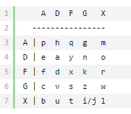

# 紧急报文

## 题目描述
```
解密一下这份截获的密文吧，时间就是机会！
FA XX DD AG FF XG FD XG DD DG GA XF FA

flag格式:flag_Xd{hSh_ctf:******}
```

## 解题思路

分析密文：FA XX DD AG FF XG FD XG DD DG GA XF FA，密文都由ADFGX组成

百度一下，发现有个ADFGX密码

> ADFGX密码(ADFGX Cipher)是结合了改良过的Polybius方格替代密码与单行换位密码的矩阵加密密码，使用了5个合理的密文字母：A，D，F，G，X，这些字母之所以这样选择是因为当转译成摩尔斯电码(ADFGX密码是德国军队在一战发明使用的密码)不易混淆，目的是尽可能减少转译过程的操作错误。

加密矩阵示例：(密文两个一组，先竖后横)



对上述密文进行解密：

FA XX DD AG FF XG FD XG DD DG GA XF FA

flagxidianctf

根据格式要求：提交flag_Xd{xidianctf},发现错误！！！

问题出在格式上，吐槽一下实验吧的格式说明，正确格式是：flag_Xd{hSh_ctf:}

提交flag_Xd{hSh_ctf:flagxidianctf}
