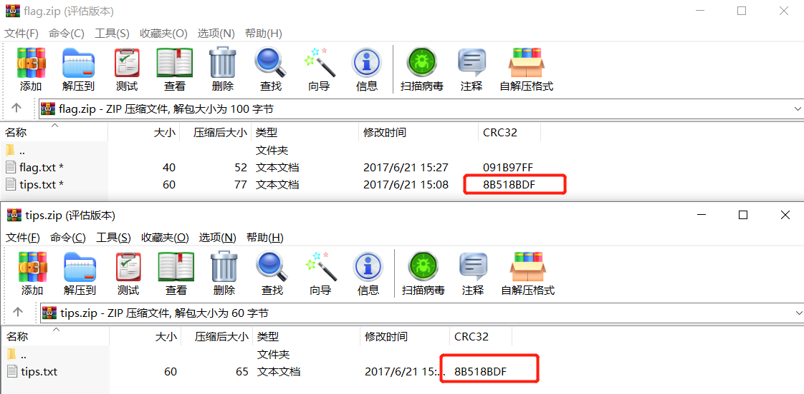
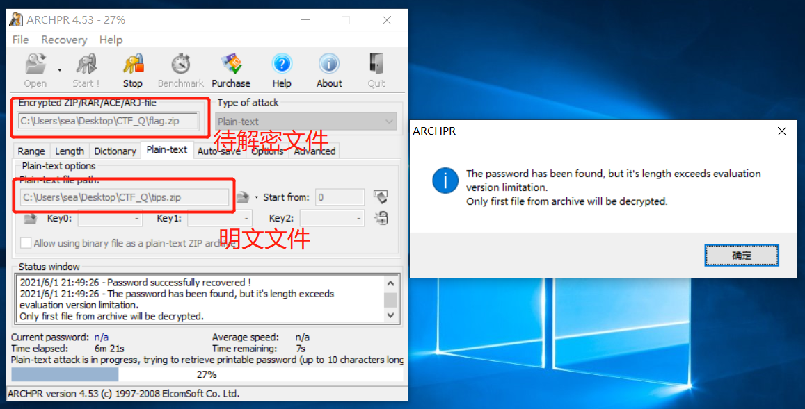
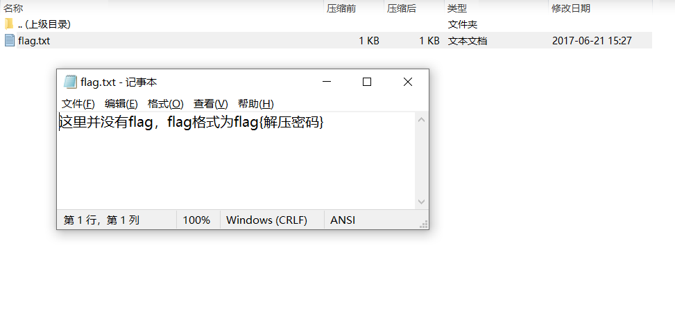
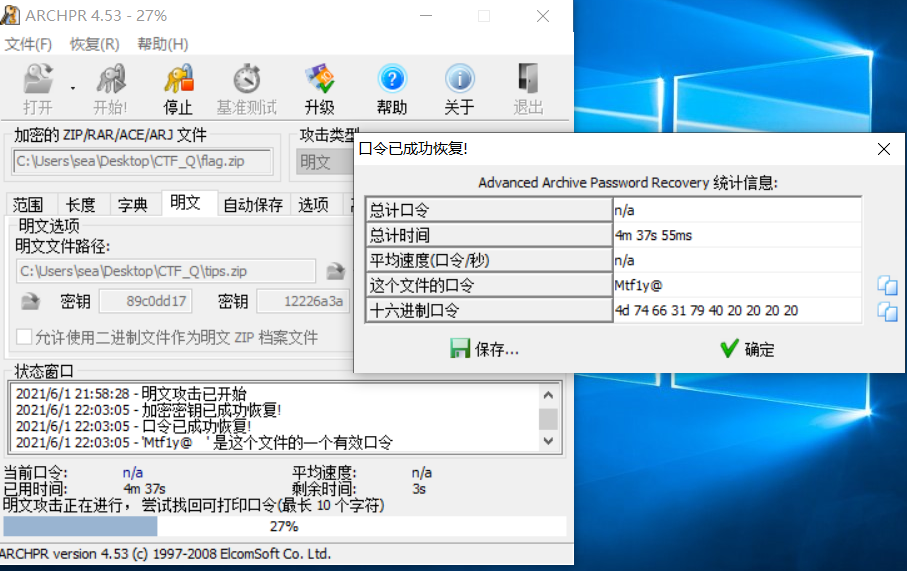

# 这就是一个坑

## 题目描述
```
密码是十位大小写字母、数字、特殊符号组成的，你爆破的开么？！
key格式：flag{xxx}

附件 no.zip
```

## 解题思路

查看附件内容，`flag.zip`文件中包含了tips.txt，并且附件里包含tips.txt文件，想到zip明文攻击。将tips.txt压缩为zip包，可以看到两个压缩包中的CRC32码一致，说明是明文攻击没错。



使用`Advanced Archive Password Recovery`进行攻击



得到取出密码后的`flag_decrypted.zip`文件



发现这个版本没有爆出密码，换一个ARCHPR再试一下



这个文件找到了，密码为`Mtf1y@    `，后面是4个空格。

明文攻击的深入利用可以参考
https://www.freebuf.com/articles/network/255145.html
