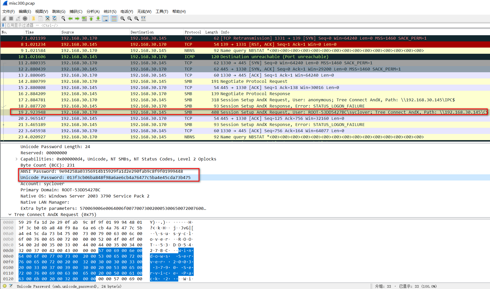

# 内网攻击数据包

## 题目描述
```
内网攻击数据包，请分析
key值为syclover明文密码
解题链接： http://ctf5.shiyanbar.com/misc/misc300.zip
```

## 解题思路

题目让找到syclover的明文密码，打开流量包，发现存在SMB协议，且有使用syclover访问的记录，这里可以获取到两个哈希



9e94258a03356914b15929fa1d2e290fab9c8f9f01999448

013f3cb06ba848f98a6ae6cb4a76477c5ba4e45cda73b475

使用方法可以参考目录中的`通过SMB抓包破解windows登陆密码`和下面的彩虹表内容，需要下载内容，这里慢慢下载。

```
彩虹表工具很多，常用到的彩虹表工具有Ophcrack、rcracki_mt、Cain等，主流的彩虹表有以下三种。

Cain: http://www.onlinedown.net/soft/53494.htm

Free Rainbow Tables
官方网址：http://www.freerainbowtables.com/en/tables/
镜像下载：http://tbhost.eu/rt.php
提供了多种类型的彩虹表下载，LM、NTLM、MD5、SHA1等。千万别把人家法语字符的表也下了，对国人来说，几乎没什么用，不过如果你有特殊需要，那就下吧……这里提供的都是.rti格式的，有别于传统的.ri格式，.rti比.rt的多了一个目录.index文件，据说遍列速度比.rt的更快（未曾对比过，无法确定是否属实）。
比较新的，用的索引和压缩，所以速度更快，体积更小，而且支持分布式破解。
支持HASH类型：LM，MD5，NTLM，SHA1，HALFLMCHALL
网上有已经生成好的表可供下载，真是造福于民。
扩展名：rti

Ophcrack
官网网址：http://ophcrack.sourceforge.net/tables.php
最常用的，界面友好，与众不同，压缩储存，有自己独特的彩虹表结构，还有Live CD。
支持的HASH类型：LM，NTLM
扩展名：乱七八糟的。

高级的表要花钱买，免费的表有（推荐只下2和5，要求高的可以下载3和5）：
1.XP free（LM表：包含大小写+数字）380MB（官网免费下载）
2.XP free fast（和前一个一样，但是速度更快）703MB（官网免费下载）
3.XP special（LM表：大小写+数字+所有符号包括空格）7.5G
4.Vista free （NTLM表：包含常用密码）461MB（官网免费下载）
5.Vista special（NTLM表：包含6位的全部可打印字符，7位的大小写字母数字，8位的小写和数字）8G

RainbowCrack
官网网址：http://project-rainbowcrack.com/table.htm
通用的，一般的破解软件如saminside都支持，命令行界面，黑客的最爱，支持CUDA。
可以自己生成表，不要钱，传说中的120G就来自于此。
支持HASH类型：LM, NTLM, MD5, SHA1, MYSQLSHA1, HALFLMCHALL, NTLMCHALL.
扩展名：rt

最小彩虹表是最基本的字母数字表，就这样它的大小就有388MB，这是Ophcrack启动盘默认的表，该表可以在11分钟内破解所有可能14位数字字母密码组合中的99.9%。国内有比较流行的传说中的120G的彩虹表，国外还有几T的海量彩虹表。win2003及以前的windows操作系统的密码采用的LM算法加密，而Vista、Win7、Win2008/R2采用的是NTLM，NTLM比LM安全得多。

LM和NTLM详解：

1、话说在远古时期，DES当道。微软在考虑9X系统口令加密的时候就自然地采用了国家标准DES一次加密8字节，留一位校检，还剩7字节（下文有解释）， 也就是LM（Lan Manage）的核心。

2、那有人要问了，万一我的口令是8位怎么办呢？不用怕，微软的程序员很“聪明”：先把前7位加密，后一位补6个0，再当7位一起加密不就可以了吗，结果就真的这么做了。

3、这就导致破解LM密码只需7位一分割，然后再逐块破解，这大大减低了破解的难度。因为最后一块往往不够7位，一般瞬间即可得出结果。也就是7位和13位的密码，在破解者眼里几乎是一样的，因为13位的后6位很快就能破解出来，而且可以根据后6位猜测出前7位的密码，这就是为什么我们破解XP和2003密码很快的原因，因为他们都使用了LM加密方式。

4、由于LM的种种不安全性，微软在设计NT系列操作系统时采用了新的口令存储手段，即NTLM技术（New Technology Lan Manage），采用MD4+RSA存储，立马安全性要高很多。但是为了保证兼容性，直到2003微软仍然保持着LM的加密方式，也就是在2000、2003和XP中，我们的口令同时保存了两份，一份LM一份NTLM，我们仍然可以通过LM破解2003的口令。

5、在Vista和2008、Win7中，微软终于下定决心对LM斩草除根，只留下NTLM，破解难度增大。

6、回到彩虹表，由于LM最多只有7位，所以它的彩虹表很小。而NTLM用了散列函数，所以理论上口令是可以无限长的，所以NTLM的彩虹表往往很大，120G肯定是不够完成所有可打印字符的，最大的彩虹表已经是T量级了。

LM和NTLM验证机制：http://www.nsfocus.net/index.php?act=magazine&do=view&mid=1665

某人用彩虹表测试破解MD5的小结：

ophcrack的表不支持破解md5，具体讲.rt .rtc .rti格式的，只需对比一组数据就可以。同样是破解12位的纯数字密码：

.rt的需要20GB .rtc的需要8.75GB .rti的需要1.67+1.67+1.68+1.71=6.72GB

明显是.rti的小，但是我试过，我下了上面.rti格式破解12位的6.72GB的表中的1.67GB，其破解效果很让我惊讶，我本以为纯数字的破解出来的可能性是四分之一，因为我只下了4个表中的一个，我只下了那1.67GB，但我试着破解了几个12位数字加密的32位md5，结果大多数都能跑出来，很少有跑不出的，汗。但当我惊喜时发现他并不支持破解16位的md5，然后去那国外的官方论坛去逛了逛，才发现这并不支持破解16位的md5。原来老外不来16位这一套，但我们国内的网站用16位的md5占绝大多数，所以入侵时大部分得到的是16位的MD5密码，而老外的就不来16位的，郁闷。

Ophcrack文档描述了它所能使用的彩虹表之间的差异：

字母数字表 10k 388MB 包含所有字母数字混合密码中99.9%的LanManager表。这些都是用大小写字母和数字组成的密码（大约800亿组合）。
由于LanManager哈希表将密码截成每份7个字符的两份，我们就可以用该表破解长度在1到14之间的密码。由于LanManager哈希表也是不区分大小写的，该表中的800亿的组合就相当于12*10的11次方（或者2的83次方）个密码。

字母数字表 5k 720MB 包含所有字母数字组合的密码中99.9%的LanManager表。但是，由于表变成2倍大，如果你的计算机有1GB以上的RAM空间的话，它的破解速度是前一个的4倍。

扩展表 7.5GB 包含最长14个大小写字母、数字以及下列33个特殊字符（!”#$%&’()*+,-./:;?@[]^_`{|} ~）组成的密码中96%的LanManager表。该表中大约有7兆的组合，5*10的12次方（或者2的92次方）密码。

NT 8.5 GB 我们可以使用该表来破解计算机上的NT哈希表，这是LanManager 哈希表所做不到的。该表包含了用如下字符组成的可能密码组合的90%：
·最高6位字符由大小写字母、数字以及33个特殊字符（同上面列举的一样）
·7 大小写字母及数字
·8 小写字母及数字
该表包含7兆种组合，对应7兆的密码（NT哈希表不存在LanManager哈希表的弱点）。

注意：所有这些彩虹表都有其特定适用的密码长度和字母组合。太长的密码（如数十位），或者包含表中没有的字符，那么用彩虹表就无法破解。
```