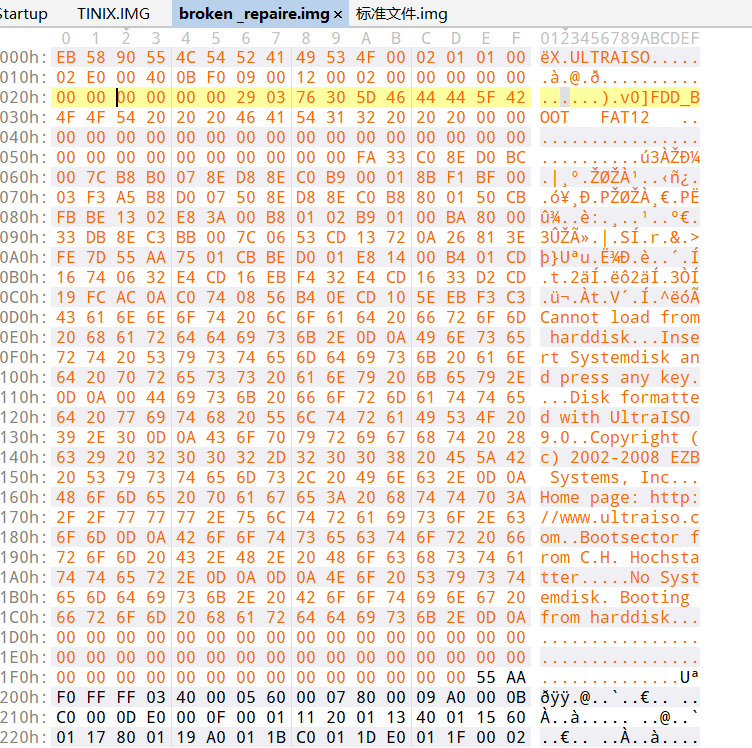

# 可启动的磁盘镜像

## 题目描述
```
我们找到一个可以启动的磁盘镜像，可是启动之后告诉我们 It's BROKEN!，怎么办？
解题链接： http://ctf5.shiyanbar.com/qwctf/broken.img
```

## 解题思路

提示光盘损坏，第一步应该就是修复光盘了


使用hex看一下，发现是分区表损坏了，BOOT中没有BPB参数

```
ext2/ext3/ext4 可以使用fsck.ext4 修复

$ fsck.ext4 broken.img                                                                                      
e2fsck 1.45.6 (20-Mar-2020)
ext2fs_open2: Bad magic number in super-block
fsck.ext4: Superblock invalid, trying backup blocks...
fsck.ext4: Bad magic number in super-block while trying to open broken.img

The superblock could not be read or does not describe a valid ext2/ext3/ext4
filesystem.  If the device is valid and it really contains an ext2/ext3/ext4
filesystem (and not swap or ufs or something else), then the superblock
is corrupt, and you might try running e2fsck with an alternate superblock:
    e2fsck -b 8193 <device>
 or
    e2fsck -b 32768 <device>

Found a dos partition table in broken.img
```

使用ultraiso生成一个img文件，将文件头复制过来




得到文件中可以看到flag文件，flag文件为一个缺少PNG魔数的PNG图片，进行修复。


可以得到flag

