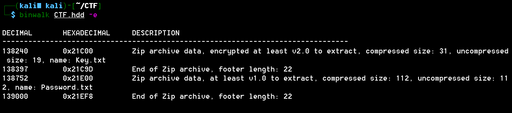
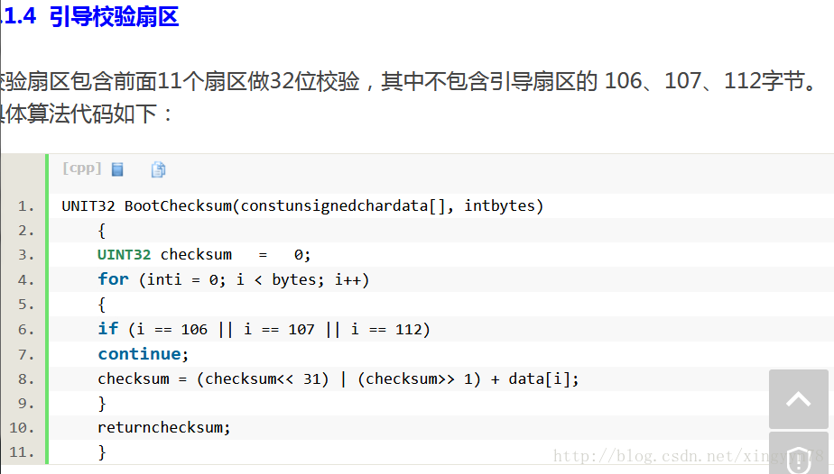
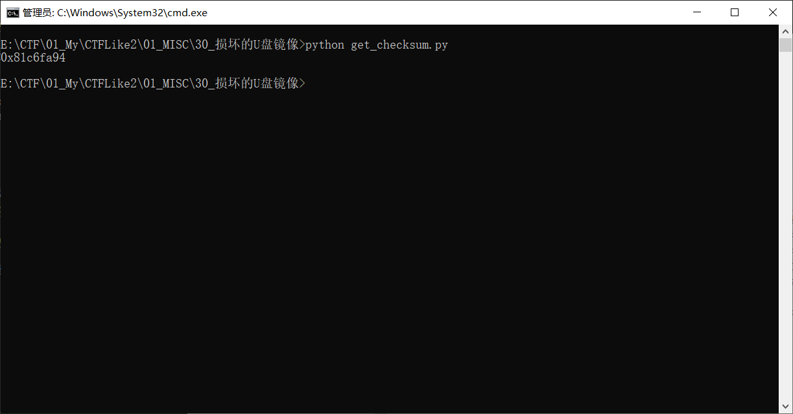

# 损坏的U盘镜像

## 题目描述
```
No Format！！！
key值：CTF{xxxx}
```

## 解题思路

使用binwalk提取U盘镜像中的文件



提取出两个zip包，一个有密码，一个没有密码，其中包含内容

```
Password：checksum的32位MD5（checksum取前4字节）
例：checksum为AABBCCDD则密码为B631050B08627046D47E0CC16250BA2E
```

告诉我们压缩包的密码是什么

通过查看exFAT文件系统格式可以得知如何计算checksum。有关exFAT文件系统格式可以参考[exFAT文件系统格式](https://blog.csdn.net/doitsjz/article/details/51351410)



文中给的是C#代码，改写成python代码进行计算checksum值。计算结果为0x81c6fa94。

```python
# -*- coding:utf8 -*-
 
file = open('CTF.hdd', 'rb')
content = file.read()
checksum = 0
for i in range(0, 11*512):
    if i == 106 or i == 107 or i == 112:
        continue
    checksum = (((checksum << 31) & int('0xFFFFFFFF', 16)) | (checksum >> 1))+content[i]
print(hex(checksum))
```



使用81c6fa94计算MD5值得到的password是错误的。查看了一下其他人的WriteUp。是因为与文件的大小端存储有关。正确的顺序为94FAC681。

计算出正确的password为C9737665D39274F6C5A256B943748068。

解压获得Key.txt.flag为CTF{ExFat-Checksum}
