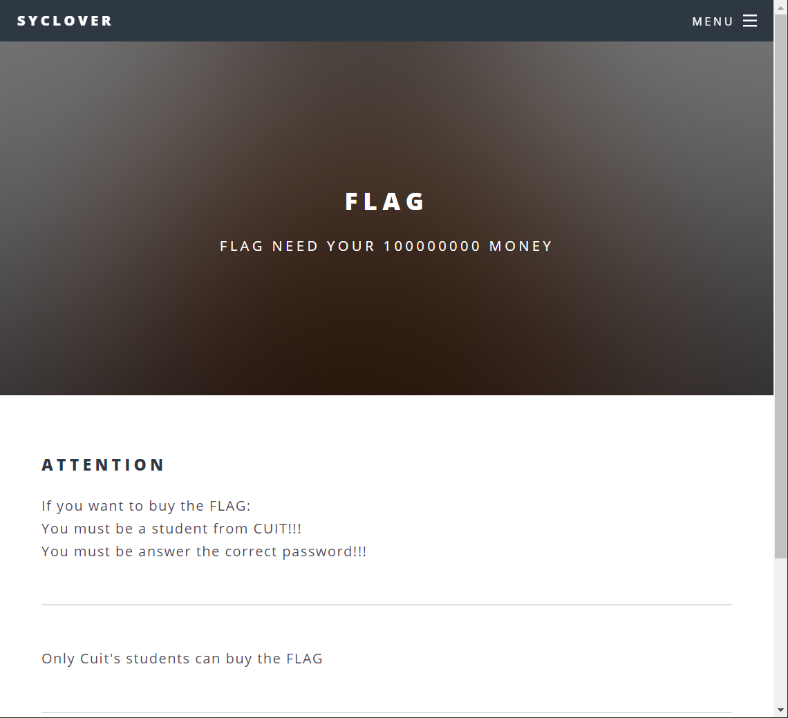
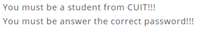
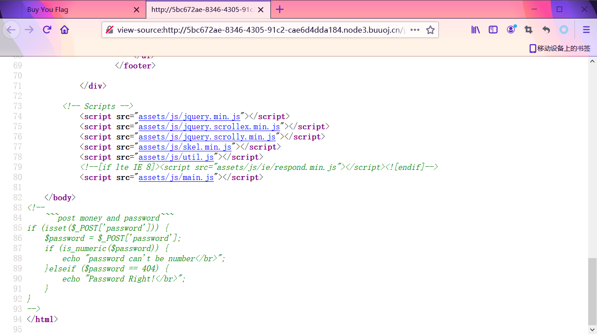
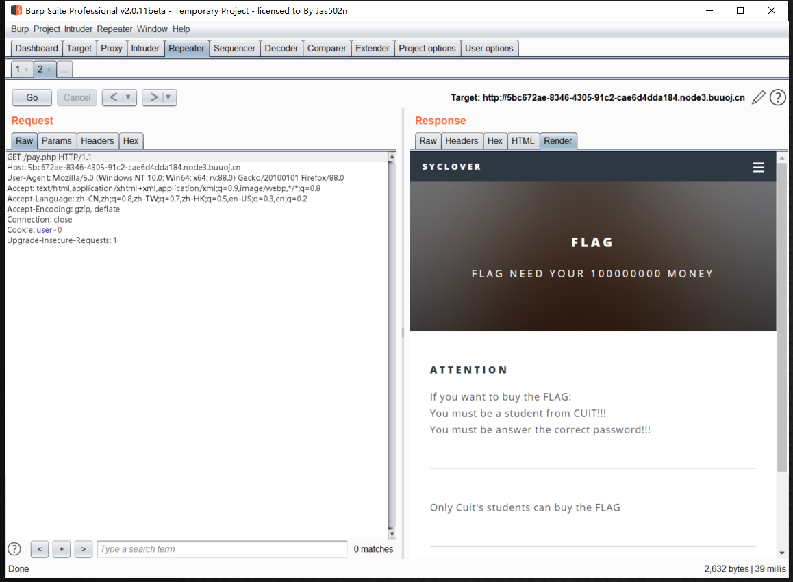
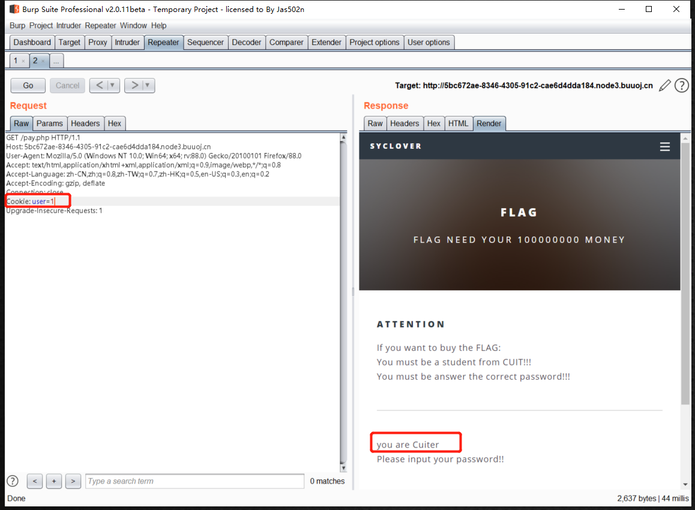
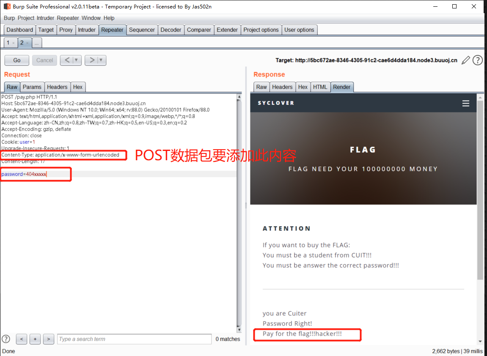
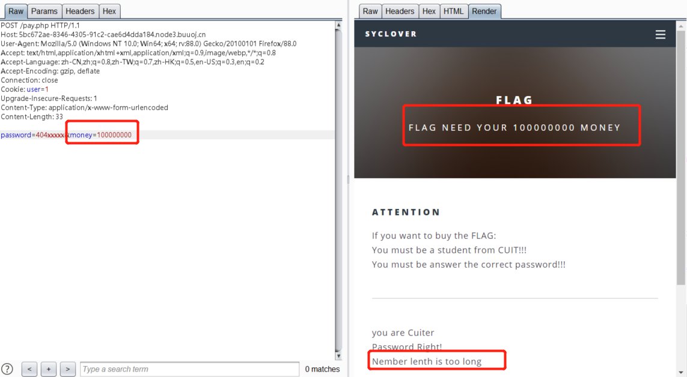
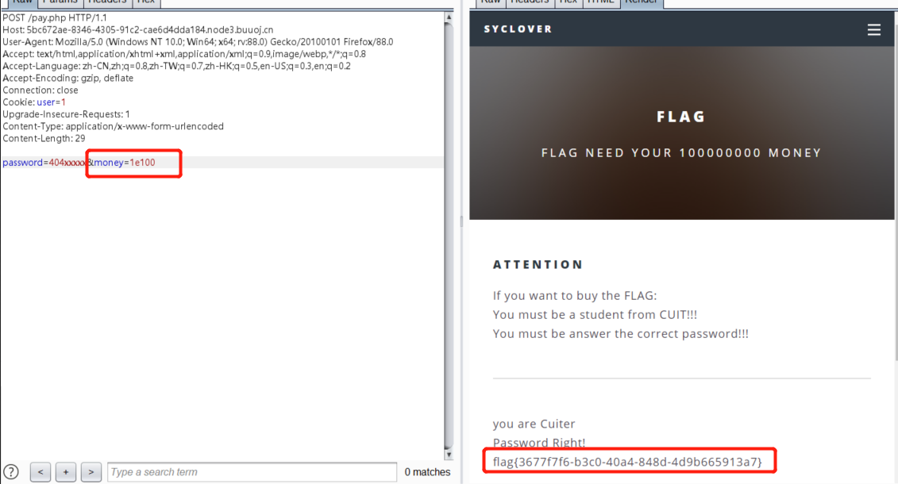

# [极客大挑战 2019]BuyFlag

## 题目描述
---


## 题目来源
---
buuctf 极客大挑战2019

## 主要知识点
---


## 题目分值
---
1

## 部署方式
---


## 解题思路
---

在pay.php页面中也看到给出了提示



在pay.php中发现提示源码



```php
<!--
	~~~post money and password~~~
if (isset($_POST['password'])) {
	$password = $_POST['password'];
	if (is_numeric($password)) {
		echo "password can't be number</br>";
	}elseif ($password == 404) {
		echo "Password Right!</br>";
	}
}
-->
```

抓取pay.php流量，发现Cookie中存在user=0




测试修改为user=1，成为CUITer，通过条件1



下面猜密码，在pay.php给出的源码可以轻松的看到，密码为`404`，但是又不能为数字，根据PHP语言特性，所以考虑使用`404xxx`可以通过此判断，如下图



题目提示给出10000000来获取Flag，在数据包中添加money参数进行测试，题目提示数字过长



根据PHP语言特性，使用`1e100`即可绕过

